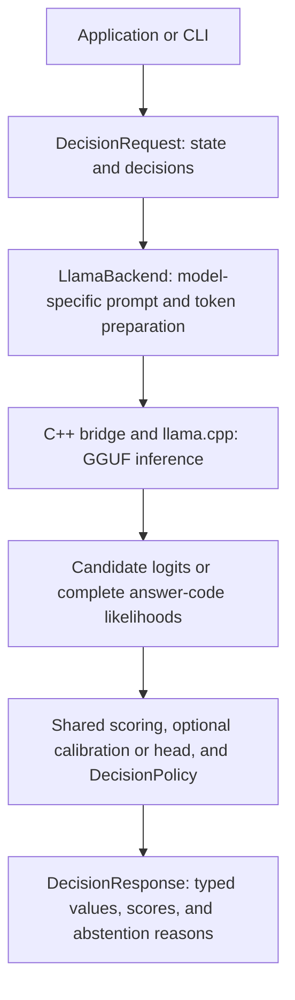

# L2S1 — LLM to System 1

**Swap the model while keeping your application's decision contract.**

L2S1 is a Rust library and CLI that turns a compatible local GGUF chat model into a typed decision backend. Applications supply a state and a list of binary, choice, or ordinal decisions. L2S1 prepares each question for the selected model, reads next-token scores, and returns a decision or an explicit abstention.

Application option IDs, result types, and acceptance rules stay consistent across models. Templates, token IDs, predictions, and calibration are model-specific. Changing a model does not guarantee the same answer or accuracy.

The crate and executable are named `l2s1`. The implemented inference backend uses **llama.cpp and local GGUF files**. Model switching currently means loading a new backend or replacing an owned worker; there is no automatic model router or live hot-swap service.

## Architecture



| Component | Responsibility |
| --- | --- |
| [`decision.rs`](src/decision.rs) | Request/response types, `DecisionBackend`, shared scoring and acceptance policy |
| [`prompt.rs`](src/prompt.rs) | Compile state, instructions and options into the selected prompt layout |
| [`llama.rs`](src/llama.rs) | Own the model/context, select the prompt profile, tokenize inputs, dispatch inference and assemble results |
| [`l2s1-llama-sys`](crates/l2s1-llama-sys), [`bridge.cpp`](crates/l2s1-llama-sys/native/bridge.cpp), [`chat.cpp`](crates/l2s1-llama-sys/native/chat.cpp) | Call llama.cpp, render GGUF Jinja templates, manage sequence memory and copy inference evidence |
| [`evidence.rs`](src/evidence.rs) | Validate complete vocabulary logits and preserve semantic option/token mappings |
| [`codes.rs`](src/codes.rs), [`llama/code_sequences.rs`](src/llama/code_sequences.rs) | Size A-Z/AA-ZZ/AAA-ZZZ codes and score complete token paths for larger candidate sets |
| [`calibration.rs`](src/calibration.rs), [`output_head.rs`](src/output_head.rs) | Optional task-scoped temperature calibration or learned output scoring |
| [`interoperability.rs`](src/interoperability.rs), [`llama/interchange.rs`](src/llama/interchange.rs) | Model fingerprints, capabilities, request preflight, structured failures and execution diagnostics |
| [`worker.rs`](src/worker.rs) | Bounded admission and dedicated-thread ownership of a backend |

The CLI calls `LlamaBackend` directly. Long-running applications can place a backend behind `BackendWorker`. Other inference providers would require another `DecisionBackend` implementation and evidence with compatible score semantics.

## The decision contract

A request has shared JSON `state` and one or more decisions. Each decision supplies an ID, an instruction and its output kind:

| Kind | Definition | Result |
| --- | --- | --- |
| `binary` | False and true criteria | `p_true` and an optional Boolean |
| `choice` | Semantic option IDs and criteria | An optional selected option ID |
| `ordinal` | Ordered levels with strictly increasing numeric values | Expected value and an optional selected level ID |

For example:

```json
{
  "state": { "storage_requirement": "chilled" },
  "decisions": [
    {
      "id": "storage_zone",
      "instruction": "Select the storage zone matching storage_requirement.",
      "kind": {
        "type": "choice",
        "options": [
          { "id": "ambient", "criterion": "Ambient storage is required." },
          { "id": "chilled", "criterion": "Chilled storage is required." },
          { "id": "frozen", "criterion": "Frozen storage is required." }
        ]
      }
    }
  ]
}
```

L2S1 maps these semantic IDs to answer codes and checks their tokenization at the model's actual assistant answer boundary. Up to 26 options retain the original `A`–`Z` single-token path. Larger candidate sets automatically use fixed-width codes: `AA`–`ZZ`, then `AAA`–`ZZZ`, and so on. Complete code-sequence likelihoods are scored when codes span multiple tokens. The application receives `chilled`, not a model-specific code, as its selected value. Token paths and raw scores remain available as evidence. See [answer-code expansion and intent evaluation](INTENT_BENCHMARK.md).

Each decision is evaluated independently. A request can contain different decision kinds over the same state; it is not encoded as a conversation in which later questions see earlier answers. See [`examples/warehouse.json`](examples/warehouse.json) for all three kinds.

### Scores and abstention

For native candidate logits `z`, L2S1 computes two separate quantities:

```text
option_probability[i] = exp(z[i] - logsumexp(candidate logits))
candidate_mass        = exp(logsumexp(candidate logits) - logsumexp(all vocabulary logits))
```

`option_probability` compares the supplied options. `candidate_mass` measures how much of the model's next-token probability belongs to those options at all. A high candidate-relative probability alone does not establish a reliable answer.

The default `DecisionPolicy` requires top-option probability at least **0.8**, candidate mass at least **0.05**, and no tied top candidates. Otherwise, the selected value is `null` and `abstention_reasons` explains why. Scores are still returned. Ordinal expected values are probability-weighted level values; they remain available when selection is withheld.

These are model scores, not universal probabilities of correctness. Partial top-k responses or model-generated numeric estimates do not satisfy the exact native evidence contract.

## Build

The pure Rust library supports validation, scoring, scalar calibration and worker ownership without native inference:

```sh
cargo test --locked
```

The inference backend and CLI require Linux, Rust with edition 2024 support, CMake, and a C++17 compiler. The `l2s1-llama-sys` workspace dependency builds llama.cpp and the matching native bridge together.

```sh
cargo build --release --locked --features llama
# CUDA toolkit required for GPU support:
cargo build --release --locked --features llama-cuda
```

The default CPU build uses CMake FetchContent to download and verify llama.cpp revision `3d82ef62d47fd74e18f36c5eccbdcf965b617b17`; the first build needs network access. For an offline build or another revision, set `L2S1_LLAMA_CPP_SOURCE=/path/to/llama.cpp`; the legacy `LLAMA_CPP_DIR` source override also works. `LLAMA_LIB_DIR` is no longer used. Validate custom revisions with the native contract tests. See [verification commands](VERIFICATION.md) and [native dependency details](crates/l2s1-llama-sys/README.md).

For an independent source release, publish `l2s1-llama-sys` before `l2s1`. A prebuilt executable must ship its matching native shared libraries with a portable loader path; swapping only `libllama.so` is unsupported.

### Dataset and benchmark tools

Data preparation, local benchmark orchestration, saved-prediction audits, and report generation use the repository-only Rust `l2s1-tools` binary. It does not link llama.cpp; inference commands launch the separately built `evaluate_jsonl` example. Model training and direct PyTorch probes remain Python workflows.

```sh
cargo build --release --locked -p l2s1-tools
target/release/l2s1-tools --help
```

See the [tool command map](crates/l2s1-tools/README.md) and each benchmark guide for arguments and evidence boundaries. Historical Python adapters remain available for artifact comparison and training imports.

Model files are supplied by the caller. Place an appropriate text chat/instruct GGUF under `models/` or another directory. The CLI does not download weights. Loading verifies checkpoint and runtime identities, including reading the full checkpoint for its checksum, so release builds are recommended.

## Inspect, validate and run

After building, inspect a model without reading a request:

```sh
./target/release/l2s1 \
  --model models/SmolLM2-135M-Instruct-Q8_0.gguf --inspect
```

Check the actual request's template, candidate tokens, context usage, execution support and active artifact bindings without a forward pass:

```sh
./target/release/l2s1 \
  --model models/SmolLM2-135M-Instruct-Q8_0.gguf \
  --input examples/warehouse.json --preflight
```

Run the same request with either compatible model:

```sh
./target/release/l2s1 \
  --model models/SmolLM2-135M-Instruct-Q8_0.gguf \
  --input examples/warehouse.json

./target/release/l2s1 \
  --model models/Qwen3-0.6B-Q8_0.gguf \
  --input examples/warehouse.json
```

The request and result schema stay the same. Each model uses its own tokenizer and prompt profile. Auto selection uses Qwen3's non-thinking profile for compatible dense Qwen3 checkpoints, Harmony final prefill for GPT-OSS, and the embedded GGUF Jinja template for other supported models.

CPU is the default. Select `--device cuda` explicitly for GPU inference. An unavailable CUDA device or unsupported model produces an error; oversized inputs are rejected without truncation. `--context`, `--batch`, `--ubatch`, `--threads` and `--flash-attention off|auto|on` control requested compute settings. `--input -` reads stdin, ordinary results go to stdout, and native logs go to stderr.

Add `--diagnostics` to receive a separate envelope containing the normal response, model identity, prompt-token fingerprints, requested/effective execution mode, fallback reasons, calibration IDs and request-local timings. Ordinary `decide()` responses retain their existing shape. Request-stage failures under `--preflight` or `--diagnostics` have structured JSON and a nonzero exit status; model loading or malformed JSON can fail before that envelope.

## Rust integration

Enable the crate's `llama` feature to use `LlamaBackend`. A caller can keep its request unchanged while passing a different model path:

```rust
use std::path::Path;
use l2s1::{
    DecisionBackend, DecisionPolicy, DecisionRequest, DecisionResponse,
    llama::LlamaBackend,
};

fn decide_with_model(
    model: &Path,
    request: &DecisionRequest,
) -> l2s1::Result<DecisionResponse> {
    let mut backend = LlamaBackend::load(
        model, 2048, 256, 4, false, DecisionPolicy::default(),
    )?;
    backend.decide(request)
}
```

For repeated requests, retain the backend instead of loading it for every call. `inspect()`, `preflight()` and `decide_detailed()` expose the corresponding inspection, validation and diagnostics APIs. `decide_batch()` accepts independent requests and preserves their result grouping.

`BackendWorker::spawn()` constructs a backend on its owner thread. Its factory can return the non-Send/non-Sync `LlamaBackend`; the native context never moves between threads. The worker bounds queued request count and serialized request size, reserves an operator-estimated memory budget, rejects a full queue immediately, and returns a `DecisionTicket` for admitted work. `close()` drains work and drops the backend on that same thread. Reservations control admission, not operating-system RSS. See [worker usage and lifecycle](MODEL_INTERCHANGEABILITY.md#bounded-ownership-and-scheduling).

`BackendWorker::spawn_batched()` additionally collects requests under explicit request-count, model-input-token and collection-wait limits. With `LlamaBackend`, native batching requires selecting `ExecutionMode::Parallel`; other modes keep requests serial. Collection alone does not make inference parallel, and the existing parallel score-drift limits still apply.

### Optional prompt detail and answer-code mixtures

`--prompt-detail minimal` and `--code-rotation 0` preserve the existing prompt and remain the defaults. `typed` adds the decision kind, semantic option IDs, ordinal values and exact-comparison guidance. `typed-examples` also adds generic numerical interval examples before the input. These variants remain model-neutral, accept changing schemas and can change predictions and context usage; they are not measured accuracy guarantees.

```sh
./target/release/l2s1 --model models/Qwen3-0.6B-Q8_0.gguf \
  --input examples/warehouse.json --prompt-detail typed-examples --code-rotation 1
```

Rotation changes code assignment: displayed position `i` represents canonical option `(i + rotation) % option_count`. The backend accepts nonnegative rotations, reduces them modulo the option count, and returns scores in the original semantic order, including the original ordinal scale. Returned codes and token IDs describe the actual rotated assignment. The corresponding Rust setters are `set_prompt_detail(PromptDetail::TypedExamples)` and `set_code_rotation(1)?`. Changing either clears preparation caches and changes the prompt identity, so calibrations and heads must match that configuration. Default response JSON omits the added detail/rotation fields.

For multiple rotated passes, `score_semantic_mixture(&decision, &passes, &policy)` aligns results by semantic option ID and pools **full candidate probabilities**:

```text
q(y)                    = mean(candidate_mass[pass] * option_probability[pass][y])
mixture candidate_mass  = mean(candidate_mass[pass])
mixture option_probability[y] = q(y) / sum(q)
```

This retains the mass gate instead of setting it to one. It accepts at least two uncalibrated native passes; learned-head, calibrated and previously mixed results are rejected. The caller must use the same model, state, task and inference configuration, changing only code rotation. Mixture scores are not calibrated probabilities of correctness. The result is marked `semantic_probability_mixture_v1`; its `raw_logit` is `ln(q)`, code/token metadata represents the first pass, and token counts sum all passes. Additional passes consume additional inference time.

The [paired evaluation example](examples/evaluate_accuracy.rs) runs these variants on JSONL records containing `id`, optional `group`, and a `request` with one decision:

```sh
cargo run --release --locked --features llama --example evaluate_accuracy -- \
  --model models/Qwen3-0.6B-Q8_0.gguf --input cases.jsonl \
  --output /tmp/l2s1-accuracy-passes.jsonl \
  --prompt-details minimal,typed,typed-examples --all-rotations
```

The output must be new. The evaluator records native passes, mixture results, configuration identities and timing without reading answer labels. Evaluate task accuracy and acceptance coverage separately on held-out labels before selecting a variant.

## Model-specific identity and calibration

A `ModelIdentity` fingerprints the checkpoint, embedded template, effective prompt profile/version, runtime build and loaded libraries, active adapter/head, device label and compute/execution configuration. `preflight()` combines that identity with checks of the actual request. Capability inspection establishes available operations; labeled evaluation establishes task quality.

Optional scalar temperature calibration is bound to the model/configuration fingerprint and exact task signature, including option order and ordinal values. Changing a binding rejects the artifact instead of applying it to another model. Calibration preserves raw logits and base candidate mass, while acceptance probabilities and coverage may change.

```sh
cargo run --release --locked --example fit_calibration -- \
  fit-input.json task-temperature.json

./target/release/l2s1 \
  --model models/SmolLM2-135M-Instruct-Q8_0.gguf \
  --input examples/warehouse.json \
  --calibration task-temperature.json --diagnostics
```

The [calibration input schema and evaluation contract](MODEL_INTERCHANGEABILITY.md#scoped-scalar-calibration) describe measured raw-score records, independent source groups, held-out NLL/Brier and policy coverage checks. No trained calibration is bundled. Multiple task-scoped artifacts can be registered, but scalar calibration cannot be stacked with an output head.

A compatible GGUF LoRA can be loaded with `--lora`. A learned task-specific scorer can be loaded with `--output-head`; hidden-feature heads currently require Gemma4, and heads require their recorded fresh-execution configuration. These are optional specializations. See [LoRA training](DECISION_FINETUNE.md) and [output-head contracts](OUTPUT_HEAD.md).

## Execution and memory

| `--execution-mode` | Behavior | Status |
| --- | --- | --- |
| `fresh` | Evaluate every decision from an empty sequence state | Default |
| `prefix-reuse` | Reuse complete prefill batches from an exact common token prefix within one request | Opt-in; recurrent/hybrid memory falls back to fresh |
| `state-restore` | Save a common prefix's whole sequence state and restore it before each suffix | Experimental; supports the tested hybrid path |
| `parallel` | Batch independent questions into isolated sequences with shared-prefix prefill | Experimental; rejects recurrent/hybrid models and can change scores |

The default prompt layout is `legacy`. `--prompt-layout state-first` places shared state earlier and can expose longer reusable prefixes, but it also changes the prompt and can change predictions.

```sh
./target/release/l2s1 --model models/Qwen3-0.6B-Q8_0.gguf \
  --input examples/warehouse.json \
  --prompt-layout state-first --execution-mode state-restore \
  --snapshot-limit-bytes 268435456 --diagnostics
```

State restoration limits its snapshot buffer to 256 MiB by default and reports fresh fallback when a snapshot cannot be used. `--parallel-width` bounds questions per parallel wave and increases context memory. Ordinary requests clear native KV state at request boundaries and after errors; snapshots never survive their native call. Neither snapshot limits nor worker reservations are whole-process memory limits.

State copying has a cost and does not guarantee a speedup. Parallel execution has measured probability and top-choice differences on some checkpoints. Both remain explicit options; see [execution details](MODEL_INTERCHANGEABILITY.md#experimental-whole-sequence-restore) and [parallel execution](PARALLEL_EXECUTION.md).

### Optional preparation and evidence optimizations

For models larger than VRAM, CUDA loading accepts `--gpu-layers N` or
`--cpu-moe-layers N` to place part of the weights in CPU RAM. Placement is recorded
in compute identity and can change numerical scores. See
[CPU/GPU placement](MODEL_INTERCHANGEABILITY.md#cpugpu-placement).

Legacy prompts, fresh execution, full evidence transfer and disabled preparation caching remain the defaults. Existing repeated requests and fixed decision schemas continue to work; none of these options requires a fixed schema.

```sh
./target/release/l2s1 --model models/Qwen3-0.6B-Q8_0.gguf \
  --input examples/warehouse.json --evidence-transfer compact \
  --preparation-cache-bytes 8388608 --preparation-cache-entries 128
```

- **Preparation cache:** retain exact prepared prompts and answer-boundary candidate mappings within one loaded backend. `PreparationCacheConfig` limits entries per cache and divides one byte budget between them. It stores token preparation, not scores or KV state; new states and schemas use the normal preparation path. Repeated calls benefit most when the backend stays resident.
- **Compact evidence:** retain candidate logits and the full-vocabulary normalizer while avoiding the complete native-host-to-Rust logits copy. llama.cpp still computes the full vocabulary and makes it available on the host. This is not GPU-side reduction or output-head elimination. It supports fresh/prefix-reuse execution without a learned output head and has a distinct calibration identity.
- **Explicit shared state:** `backend.shared_state(state)?` borrows a backend configured for `PrefixReuse`. Repeated `session.decide(decisions)` calls may change IDs, instructions, option counts and decision kinds while sharing exact decoder prefixes over that immutable state. Session creation, errors and drop clear native state. Recurrent/hybrid models and output heads are rejected. This is a decoder session, not a separately trained state encoder.

See [optimization APIs and limits](MODEL_INTERCHANGEABILITY.md#optional-execution-optimizations). The [local benchmark harness](examples/benchmark_optimizations.rs) compares fresh, cached, compact and shared-state paths using mixed-schema warehouse questions, records raw scores and selection differences, and refuses to overwrite its output:

```sh
cargo run --release --locked --features llama --example benchmark_optimizations -- \
  --model models/Qwen3-0.6B-Q8_0.gguf --output /tmp/l2s1-optimizations.json
```

Repeat `--model` for additional checkpoints; use `--cuda` explicitly for GPU runs. The default benchmark uses three rounds, 1/4/16 questions and short/long synthetic states. It warms each path before timing, rotates path order and compares shared-state results to the same state-first prompt layout. Timings establish local workload behavior, not a general speedup or task accuracy.

## Compatibility and validation

A compatible checkpoint must be a decoder-only model supported by the linked runtime, have a renderable GGUF chat template that preserves the payload, and fit the chosen device/context. Decisions require at least two candidates; answer-code width grows automatically without an alphabet-derived count ceiling. The original path requires unique single-token continuations; multi-letter codes require stable, unique, prefix-free token sequences and support fresh or prefix-reuse execution with full evidence, without output heads, scalar calibration or feature export. Prompt length, answer-prefix length and available memory still bound real workloads. Compatibility is checked against actual model behavior rather than a general family-name promise.

Local conformance checks have covered SmolLM2, Qwen3, Gemma3, TinyLlama, Gemma4, a Qwen3.8 file with `qwen35` hybrid architecture, and GPT-OSS across CPU/CUDA configurations. Support remains checkpoint- and configuration-specific; use the [verification guide](VERIFICATION.md) for your model. Base models without suitable templates, encoder-only models, multimodal inputs and multi-token candidate scoring are outside the current contract.

```sh
cargo test --locked
cargo test --release --locked --features llama

L2S1_CONFORMANCE_MODELS=/path/to/model-a.gguf:/path/to/model-b.gguf \
  L2S1_CONFORMANCE_REPORT=/tmp/conformance.json \
  cargo test --release --locked --features llama \
  --test conformance -- --ignored --nocapture
```

The general test run skips model-dependent tests; invoke them explicitly with local checkpoints. Add `SKID_CUDA=1` to run conformance on CUDA. Tests do not download weights. Contract checks establish synthetic compatibility, not production accuracy. Keep generated conformance reports and benchmark artifacts in local output directories.

## Recorded model comparison

The September 23, 2026 JevBench matrix measured **22 GGUF checkpoints on all 231 public items** using the same frozen project build on an RTX 3060 12 GiB. All 5,082 predictions in the completed comparison runs were valid, with no inference errors or truncation. The 23 runtime configurations include one failed default GPT-OSS attempt and its successful CUDA Graphs-disabled recovery.

Completed rows use identical request and evaluator hashes, fresh/legacy execution, context 8192, batch/ubatch 256, four threads and FlashAttention off, without reasoning-token generation, LoRA, an output head or learned calibration. The explicit GPT-OSS exception is marked below.

| Checkpoint | Argmax accuracy | Hard accuracy | Accepted wrong | Abstained / 231 | p50 / p95 ms |
| --- | ---: | ---: | ---: | ---: | ---: |
| Qwen3.5-4B-Q8_0 | 79.65% | 61.26% | 9 | 93 | 86.88 / 1137.30 |
| Qwen3.5-9B-Q4_K_M | 77.92% | 58.56% | 13 | 64 | 130.55 / 1697.14 |
| Qwen3.5-9B-Q8_0 | 77.92% | 56.76% | 14 | 66 | 124.68 / 1613.79 |
| gemma-4-E4B-it-Q4_K_M | 77.49% | 55.86% | 30 | 37 | 86.62 / 1186.47 |
| gemma-4-E4B-it-Q8_0 | 76.62% | 54.05% | 32 | 37 | 85.04 / 1146.21 |
| Qwen3.5-4B-Q4_K_M | 76.19% | 55.86% | 10 | 91 | 88.47 / 1175.18 |
| Qwen3.8-27B-UD-IQ2_XXS | 73.16% | 47.75% | 18 | 84 | 414.61 / 5460.22 |
| Qwen3-8B-Q8_0 | 71.43% | 48.65% | 56 | 15 | 121.45 / 1817.94 |
| gemma-4-E2B-it-Q8_0 | 67.97% | 43.24% | 58 | 22 | 46.79 / 701.11 |
| Qwen3-4B-Q8_0 | 65.80% | 44.14% | 63 | 29 | 85.26 / 1349.28 |
| Ministral-3-8B-Instruct-2512-Q4_K_M | 65.37% | 47.75% | 23 | 93 | 441.43 / 2399.70 |
| gpt-oss-20b-Q4_K_M (CUDA Graphs off) | 64.94% | 48.65% | 31 | 82 | 181.93 / 2262.28 |
| Qwen3.5-2B-Q8_0 | 62.34% | 48.65% | 15 | 133 | 40.99 / 513.03 |
| gemma-3-4b-it-Q8_0 | 59.74% | 36.04% | 88 | 9 | 74.71 / 879.92 |
| Phi-4-mini-instruct.Q8_0 | 56.71% | 42.34% | 30 | 115 | 70.50 / 971.95 |
| Qwen3.5-0.8B-Q8_0 | 51.95% | 42.34% | 16 | 183 | 27.93 / 350.53 |
| SmolLM3-3B-Q8_0 | 46.32% | 31.53% | 41 | 127 | 71.47 / 884.76 |
| Llama-3.2-3B-Instruct-Q8_0 | 43.72% | 30.63% | 46 | 147 | 68.18 / 884.75 |
| gemma-3-1b-it-Q8_0 | 38.96% | 28.83% | 121 | 30 | 25.06 / 309.24 |
| tinyllama-1.1b-chat-v1.0.Q4_K_M | 33.77% | 36.04% | 1 | 230 | 30.08 / 702.65 |
| Qwen3-0.6B-Q8_0 | 31.60% | 31.53% | 129 | 41 | 34.01 / 445.12 |
| SmolLM2-135M-Instruct-Q8_0 | 30.30% | 29.73% | 8 | 211 | 14.88 / 253.65 |

Qwen3.5-4B Q8_0 had the highest argmax accuracy in this selected matrix: 184/231 (79.65%), including 68/111 Hard items (61.26%). Its default policy accepted 138 decisions: 129 correct and 9 wrong, for 93.48% accepted accuracy at 59.74% coverage. Qwen3.5-9B Q4_K_M covered 72.29% with 13 accepted errors; Gemma4 E2B covered 90.48% with 58 accepted errors. Accuracy before abstention, accepted accuracy and coverage answer different questions.

GPT-OSS 20B Q4_K_M exhausted GPU memory in `cudaGraphInstantiate` after 129 predictions. With `GGML_CUDA_DISABLE_GRAPHS=1`, it completed all 231 at 64.94% accuracy and a sampled peak of 11,901 MiB. Its first 129 probability distributions were identical to the failed run. Keep this runtime exception when reproducing its result.

After model downloads finished, complete reruns of Qwen3.5-4B Q8_0 and Gemma4 E2B produced identical probabilities for every item. Their confirmation p50/p95 latencies were 86.99/1139.49 ms and 46.08/699.14 ms respectively; the table retains the original matrix timings.

These are public-subset, local inference measurements, not an official full-suite score, rank or production validation. Latency excludes loading and warmup; small models may exceed their training context. The raw predictions, model/source hashes, memory samples, failed-attempt evidence and independent accuracy/Brier/ECE recount are in the local, gitignored `results/jevbench-matrix-20260923/` directory; they are not included in this repository. The measured source snapshot is kept with those artifacts, and later working-tree optimizations are outside this frozen comparison. See the [evaluation method](JEVBENCH.md).

## Further documentation

| Topic | Document |
| --- | --- |
| Identity, preflight, calibration, diagnostics and worker API | [Model interchangeability](MODEL_INTERCHANGEABILITY.md) |
| Build and model-specific validation | [Verification guide](VERIFICATION.md) |
| Prefix reuse and parallel execution | [Prefix algorithm](SEMIF_ALGORITHM.md), [parallel execution](PARALLEL_EXECUTION.md) |
| Evaluation methods | [Synthetic benchmark](BENCHMARK.md), [AG News](KAGGLE_BENCHMARK.md), [JevBench](JEVBENCH.md), [Laya/Jev tasks and CPU caching](LAYA_BENCHMARK.md) |
| Optional model/task adaptation | [Decision fine-tuning](DECISION_FINETUNE.md), [output heads](OUTPUT_HEAD.md) |

## License

Project source is [MIT-licensed](LICENSE). Preserve the dependency notices in [THIRD_PARTY_LICENSES.txt](THIRD_PARTY_LICENSES.txt) when distributing the native components. Model weights have their own licenses; see [LICENSING.md](LICENSING.md) for the source and model distinction.

Model weights, local build/results directories and the separate `web/` directory are excluded from the Cargo package. No weights are bundled with the source or tests.
