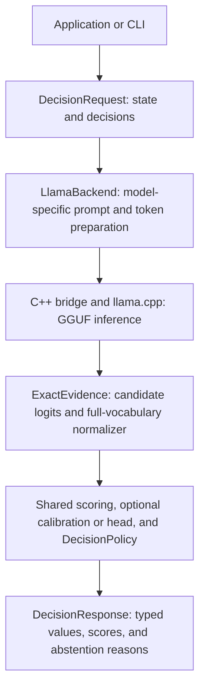

# L2S1 — LLM to System 1

**Swap the model while keeping your application's decision contract.**

L2S1 is a Rust library and CLI that turns a compatible local GGUF chat model into a typed decision backend. Applications supply a state and a list of binary, choice, or ordinal decisions. L2S1 prepares each question for the selected model, reads next-token scores, and returns a decision or an explicit abstention.

Application option IDs, result types, and acceptance rules stay consistent across models. Templates, token IDs, predictions, and calibration are model-specific. Changing a model does not guarantee the same answer or accuracy.

The crate and executable are named `l2s1`. The implemented inference backend uses **llama.cpp and local GGUF files**. Model switching currently means loading a new backend or replacing an owned worker; there is no automatic model router or live hot-swap service.

## Architecture



| Component | Responsibility |
| --- | --- |
| [`decision.rs`](src/decision.rs) | Request/response types, `DecisionBackend`, shared scoring and acceptance policy |
| [`prompt.rs`](src/prompt.rs) | Compile state, instructions and options into the selected prompt layout |
| [`llama.rs`](src/llama.rs) | Own the model/context, select the prompt profile, tokenize inputs, dispatch inference and assemble results |
| [`native/bridge.cpp`](native/bridge.cpp), [`native/chat.cpp`](native/chat.cpp) | Call llama.cpp, render GGUF Jinja templates, manage sequence memory and copy inference evidence |
| [`evidence.rs`](src/evidence.rs) | Validate complete vocabulary logits and preserve semantic option/token mappings |
| [`calibration.rs`](src/calibration.rs), [`output_head.rs`](src/output_head.rs) | Optional task-scoped temperature calibration or learned output scoring |
| [`interoperability.rs`](src/interoperability.rs), [`llama/interchange.rs`](src/llama/interchange.rs) | Model fingerprints, capabilities, request preflight, structured failures and execution diagnostics |
| [`worker.rs`](src/worker.rs) | Bounded admission and dedicated-thread ownership of a backend |

The CLI calls `LlamaBackend` directly. Long-running applications can place a backend behind `BackendWorker`. Other inference providers would require another `DecisionBackend` implementation and evidence with compatible score semantics.

## The decision contract

A request has shared JSON `state` and one or more decisions. Each decision supplies an ID, an instruction and its output kind:

| Kind | Definition | Result |
| --- | --- | --- |
| `binary` | False and true criteria | `p_true` and an optional Boolean |
| `choice` | Semantic option IDs and criteria | An optional selected option ID |
| `ordinal` | Ordered levels with strictly increasing numeric values | Expected value and an optional selected level ID |

For example:

```json
{
  "state": { "storage_requirement": "chilled" },
  "decisions": [
    {
      "id": "storage_zone",
      "instruction": "Select the storage zone matching storage_requirement.",
      "kind": {
        "type": "choice",
        "options": [
          { "id": "ambient", "criterion": "Ambient storage is required." },
          { "id": "chilled", "criterion": "Chilled storage is required." },
          { "id": "frozen", "criterion": "Frozen storage is required." }
        ]
      }
    }
  ]
}
```

L2S1 maps these semantic IDs to codes `A`, `B`, `C`, then checks their token IDs at the model's actual assistant answer boundary. Each code must be a unique, stable, single-token continuation. The application receives `chilled`, not a model-specific token ID, as its selected value. Token IDs and raw scores remain available as evidence.

Each decision is evaluated independently. A request can contain different decision kinds over the same state; it is not encoded as a conversation in which later questions see earlier answers. See [`examples/warehouse.json`](examples/warehouse.json) for all three kinds.

### Scores and abstention

For native candidate logits `z`, L2S1 computes two separate quantities:

```text
option_probability[i] = exp(z[i] - logsumexp(candidate logits))
candidate_mass        = exp(logsumexp(candidate logits) - logsumexp(all vocabulary logits))
```

`option_probability` compares the supplied options. `candidate_mass` measures how much of the model's next-token probability belongs to those options at all. A high candidate-relative probability alone does not establish a reliable answer.

The default `DecisionPolicy` requires top-option probability at least **0.8**, candidate mass at least **0.05**, and no tied top candidates. Otherwise, the selected value is `null` and `abstention_reasons` explains why. Scores are still returned. Ordinal expected values are probability-weighted level values; they remain available when selection is withheld.

These are model scores, not universal probabilities of correctness. Partial top-k responses or model-generated numeric estimates do not satisfy the exact native evidence contract.

## Build

The pure Rust library supports validation, scoring, scalar calibration and worker ownership without native inference:

```sh
cargo test --locked
```

The inference backend and CLI require Linux, Rust with edition 2024 support, a C++17 compiler, and a matching llama.cpp source checkout and shared-library build. The source must include `include/llama.h`, `src/llama-ext.h`, `common/jinja`, its JSON/Unicode helpers, and `vendor/nlohmann`.

```sh
export LLAMA_CPP_DIR=/path/to/llama.cpp
export LLAMA_LIB_DIR="$LLAMA_CPP_DIR/build-cuda/bin"

cargo build --release --locked --features llama
```

Cargo compiles L2S1's native bridge and template helpers; libllama and its CPU/CUDA backends must already be built. Source, headers and shared libraries must match. A CPU-only shared-library build is also usable. The local verification used llama.cpp revision `3d82ef62d47fd74e18f36c5eccbdcf965b617b17`; see [runtime and checkpoint provenance](VERIFICATION.md).

Model files are supplied by the caller. Place an appropriate text chat/instruct GGUF under `models/` or another directory. The CLI does not download weights. Loading verifies checkpoint and runtime identities, including reading the full checkpoint for its checksum, so release builds are recommended.

## Inspect, validate and run

After building, inspect a model without reading a request:

```sh
./target/release/l2s1 \
  --model models/SmolLM2-135M-Instruct-Q8_0.gguf --inspect
```

Check the actual request's template, candidate tokens, context usage, execution support and active artifact bindings without a forward pass:

```sh
./target/release/l2s1 \
  --model models/SmolLM2-135M-Instruct-Q8_0.gguf \
  --input examples/warehouse.json --preflight
```

Run the same request with either compatible model:

```sh
./target/release/l2s1 \
  --model models/SmolLM2-135M-Instruct-Q8_0.gguf \
  --input examples/warehouse.json

./target/release/l2s1 \
  --model models/Qwen3-0.6B-Q8_0.gguf \
  --input examples/warehouse.json
```

The request and result schema stay the same. Each model uses its own tokenizer and prompt profile. Auto selection uses Qwen3's non-thinking profile for compatible dense Qwen3 checkpoints, Harmony final prefill for GPT-OSS, and the embedded GGUF Jinja template for other supported models.

CPU is the default. Select `--device cuda` explicitly for GPU inference. An unavailable CUDA device or unsupported model produces an error; oversized inputs are rejected without truncation. `--context`, `--batch`, `--ubatch`, `--threads` and `--flash-attention off|auto|on` control requested compute settings. `--input -` reads stdin, ordinary results go to stdout, and native logs go to stderr.

Add `--diagnostics` to receive a separate envelope containing the normal response, model identity, prompt-token fingerprints, requested/effective execution mode, fallback reasons, calibration IDs and request-local timings. Ordinary `decide()` responses retain their existing shape. Request-stage failures under `--preflight` or `--diagnostics` have structured JSON and a nonzero exit status; model loading or malformed JSON can fail before that envelope.

## Rust integration

Enable the crate's `llama` feature to use `LlamaBackend`. A caller can keep its request unchanged while passing a different model path:

```rust
use std::path::Path;
use l2s1::{
    DecisionBackend, DecisionPolicy, DecisionRequest, DecisionResponse,
    llama::LlamaBackend,
};

fn decide_with_model(
    model: &Path,
    request: &DecisionRequest,
) -> l2s1::Result<DecisionResponse> {
    let mut backend = LlamaBackend::load(
        model, 2048, 256, 4, false, DecisionPolicy::default(),
    )?;
    backend.decide(request)
}
```

For repeated requests, retain the backend instead of loading it for every call. `inspect()`, `preflight()` and `decide_detailed()` expose the corresponding inspection, validation and diagnostics APIs. `decide_batch()` accepts independent requests and preserves their result grouping.

`BackendWorker::spawn()` constructs a backend on its owner thread. Its factory can return the non-Send/non-Sync `LlamaBackend`; the native context never moves between threads. The worker bounds queued request count and serialized request size, reserves an operator-estimated memory budget, rejects a full queue immediately, and returns a `DecisionTicket` for admitted work. `close()` drains work and drops the backend on that same thread. Reservations control admission, not operating-system RSS. See [worker usage and lifecycle](MODEL_INTERCHANGEABILITY.md#bounded-ownership-and-scheduling).

## Model-specific identity and calibration

A `ModelIdentity` fingerprints the checkpoint, embedded template, effective prompt profile/version, runtime build and loaded libraries, active adapter/head, device label and compute/execution configuration. `preflight()` combines that identity with checks of the actual request. Capability inspection establishes available operations; labeled evaluation establishes task quality.

Optional scalar temperature calibration is bound to the model/configuration fingerprint and exact task signature, including option order and ordinal values. Changing a binding rejects the artifact instead of applying it to another model. Calibration preserves raw logits and base candidate mass, while acceptance probabilities and coverage may change.

```sh
cargo run --release --locked --example fit_calibration -- \
  fit-input.json task-temperature.json

./target/release/l2s1 \
  --model models/SmolLM2-135M-Instruct-Q8_0.gguf \
  --input examples/warehouse.json \
  --calibration task-temperature.json --diagnostics
```

The [calibration input schema and evaluation contract](MODEL_INTERCHANGEABILITY.md#scoped-scalar-calibration) describe measured raw-score records, independent source groups, held-out NLL/Brier and policy coverage checks. No trained calibration is bundled. Multiple task-scoped artifacts can be registered, but scalar calibration cannot be stacked with an output head.

A compatible GGUF LoRA can be loaded with `--lora`. A learned task-specific scorer can be loaded with `--output-head`; hidden-feature heads currently require Gemma4, and heads require their recorded fresh-execution configuration. These are optional specializations. See [LoRA training](DECISION_FINETUNE.md) and [output-head contracts](OUTPUT_HEAD.md).

## Execution and memory

| `--execution-mode` | Behavior | Status |
| --- | --- | --- |
| `fresh` | Evaluate every decision from an empty sequence state | Default |
| `prefix-reuse` | Reuse complete prefill batches from an exact common token prefix within one request | Opt-in; recurrent/hybrid memory falls back to fresh |
| `state-restore` | Save a common prefix's whole sequence state and restore it before each suffix | Experimental; supports the tested hybrid path |
| `parallel` | Batch independent questions into isolated sequences with shared-prefix prefill | Experimental; rejects recurrent/hybrid models and can change scores |

The default prompt layout is `legacy`. `--prompt-layout state-first` places shared state earlier and can expose longer reusable prefixes, but it also changes the prompt and can change predictions.

```sh
./target/release/l2s1 --model models/Qwen3-0.6B-Q8_0.gguf \
  --input examples/warehouse.json \
  --prompt-layout state-first --execution-mode state-restore \
  --snapshot-limit-bytes 268435456 --diagnostics
```

State restoration limits its snapshot buffer to 256 MiB by default and reports fresh fallback when a snapshot cannot be used. `--parallel-width` bounds questions per parallel wave and increases context memory. Cache state is cleared at request boundaries and after errors; snapshots never survive their native call. Neither snapshot limits nor worker reservations are whole-process memory limits.

State copying has a cost and does not guarantee a speedup. Parallel execution has measured probability and top-choice differences on some checkpoints. Both remain explicit options; see [execution details](MODEL_INTERCHANGEABILITY.md#experimental-whole-sequence-restore) and [parallel measurements](PARALLEL_EXECUTION.md).

## Compatibility and validation

A compatible checkpoint must be a decoder-only model supported by the linked runtime, have a renderable GGUF chat template that preserves the payload, fit the chosen device/context, and provide unique single-token continuations for every requested code. There are 2–26 candidates per decision. Compatibility is checked against actual model behavior rather than a general family-name promise.

The [interchangeability record](MODEL_INTERCHANGEABILITY_RESULTS.md) covers seven local checkpoints: SmolLM2, Qwen3, Gemma3, TinyLlama, Gemma4, a Qwen3.8 file with `qwen35` hybrid architecture, and GPT-OSS. It records exact identities, CPU/CUDA scope, fresh/restore comparisons and the parallel-equivalence failures. Base models without suitable templates, encoder-only models, multimodal inputs and multi-token candidate scoring are outside the current contract.

```sh
cargo test --locked
cargo test --release --locked --features llama

L2S1_CONFORMANCE_MODELS=/path/to/model-a.gguf:/path/to/model-b.gguf \
  L2S1_CONFORMANCE_REPORT=/tmp/conformance.json \
  cargo test --release --locked --features llama \
  --test conformance -- --ignored --nocapture
```

The general test run skips model-dependent tests; invoke them explicitly with local checkpoints. Add `SKID_CUDA=1` to run conformance on CUDA. Tests do not download weights. The recorded default/native suites passed 21/30 tests; real-model contract checks and the original-response comparison are reported separately. Those checks are synthetic compatibility evidence, not production accuracy guarantees.

## Recorded model comparison

The September 23, 2026 JevBench matrix report measures the same 231 public items on an RTX 3060 12 GiB. **Nine of 22 planned configurations were scored; 13 were still pending.** All scored rows used identical request and evaluator hashes, fresh/legacy execution, context 8192, batch/ubatch 256, four threads and FlashAttention off, without reasoning-token generation, LoRA, an output head or learned calibration.

| Checkpoint | Argmax accuracy | Accepted wrong | Abstained / 231 | p50 / p95 ms |
| --- | ---: | ---: | ---: | ---: |
| Qwen3.5-4B-Q8_0 | 79.65% | 9 | 93 | 86.88 / 1137.30 |
| Qwen3.5-4B-Q4_K_M | 76.19% | 10 | 91 | 88.47 / 1175.18 |
| gemma-4-E2B-it-Q8_0 | 67.97% | 58 | 22 | 46.79 / 701.11 |
| Qwen3.5-2B-Q8_0 | 62.34% | 15 | 133 | 40.99 / 513.03 |
| Qwen3.5-0.8B-Q8_0 | 51.95% | 16 | 183 | 27.93 / 350.53 |
| gemma-3-1b-it-Q8_0 | 38.96% | 121 | 30 | 25.06 / 309.24 |
| tinyllama-1.1b-chat-v1.0.Q4_K_M | 33.77% | 1 | 230 | 30.08 / 702.65 |
| Qwen3-0.6B-Q8_0 | 31.60% | 129 | 41 | 34.01 / 445.12 |
| SmolLM2-135M-Instruct-Q8_0 | 30.30% | 8 | 211 | 14.88 / 253.65 |

Argmax accuracy counts the top candidate before abstention; it is separate from the accuracy of accepted decisions. For Qwen3.5-4B Q8_0, the default policy accepted 138 decisions, including 129 correct and 9 wrong, and abstained on 93. That is 93.48% accepted accuracy at 59.74% coverage. Gemma4 E2B accepted 209, including 58 wrong, illustrating why model-specific evaluation matters even with the same contract and thresholds.

These are single-run, public-subset measurements, not an official full-suite score or rank. Latency excludes loading and warmup; small models may exceed their training context. The source report records independent recounting of predictions, Brier and ECE. These figures summarize the supplied report; the remote matrix was not rerun for this documentation. See the [evaluation method](JEVBENCH.md).

## Further documentation

| Topic | Document |
| --- | --- |
| Identity, preflight, calibration, diagnostics and worker API | [Model interchangeability](MODEL_INTERCHANGEABILITY.md) |
| Checkpoint-specific conformance and regression evidence | [Implementation results](MODEL_INTERCHANGEABILITY_RESULTS.md), [JSON evidence](MODEL_INTERCHANGEABILITY_RESULTS.json) |
| Design sources and adoption decisions | [Design review](MODEL_INTERCHANGEABILITY_REVIEW.md) |
| Runtime provenance and earlier native checks | [Verification](VERIFICATION.md), [model specifications](MODEL_SPECS.md) |
| Prefix reuse and parallel execution | [Prefix algorithm](SEMIF_ALGORITHM.md), [parallel execution](PARALLEL_EXECUTION.md) |
| Labeled synthetic decision benchmark | [Benchmark guide](BENCHMARK.md), [recorded results](BENCHMARK_RESULTS.md) |
| Optional model/task adaptation | [Decision fine-tuning](DECISION_FINETUNE.md), [output heads](OUTPUT_HEAD.md) |

## License

Project source is [MIT-licensed](LICENSE). Preserve the dependency notices in [THIRD_PARTY_LICENSES.txt](THIRD_PARTY_LICENSES.txt) when distributing the native components. Model weights have their own licenses; see [LICENSING.md](LICENSING.md) for the reviewed scope.

Model weights, local build/results directories and the separate `web/` directory are excluded from the Cargo package. No weights are bundled with the source or tests.
