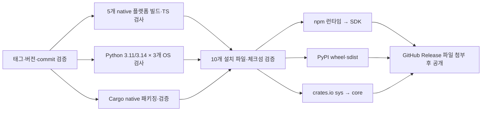

# SDK 배포 파이프라인

[workflow](../.github/workflows/release.yml)는 `vMAJOR.MINOR.PATCH` 태그 push 또는
Actions의 **Publish SDKs and native runtimes** 수동 실행으로 시작합니다.
수동 실행에는 이미 존재하는 태그를 입력합니다. 저장소에 이 변경을 커밋하고
새 태그를 push해야 실제 파이프라인이 실행됩니다.



| 대상 | 배포물 | 인증 |
| --- | --- | --- |
| npm | `@l2s1/node` 및 5개 `@l2s1/runtime-*` | OIDC trusted publisher; 최초 게시용 `NPM_TOKEN` 선택 지원 |
| PyPI | `l2s1-sdk` wheel·sdist | OIDC trusted publisher 또는 pending publisher |
| crates.io | `l2s1-llama-sys` → `l2s1` | OIDC trusted publisher; 최초 게시용 `CARGO_REGISTRY_TOKEN` 선택 지원 |
| GitHub Release | 위 10개 파일 + `SHA256SUMS`·`release.json` | 저장소 `GITHUB_TOKEN`, 최종 job에만 contents write |

native 플랫폼은 Linux x64/arm64, macOS x64/arm64, Windows x64입니다. macOS arm64는
CPU·Metal, 나머지는 CPU를 번들에 포함합니다. CUDA는 Cargo feature/사용자 빌드를
사용합니다. Python wheel은 같은 native runtime 번들을 재사용하며 모델은 별도입니다.

## 최초 설정

1. GitHub 환경 `npm`, `pypi`, `crates-io`를 사용합니다. 각 레지스트리의 사용자·조직에
   해당 패키지 게시 권한이 있어야 합니다. 환경 보호 규칙은 저장소 설정에 따릅니다.
2. npm의 **6개 패키지 각각**에 사용자 `LuticaCANARD`, 저장소 `L2S1`, workflow
   `release.yml`, 환경 `npm`으로 trusted publisher를 설정합니다. 직접 `npm publish`를
   허용하는 allowed action을 선택하세요. npm 11+를 workflow에서 설치합니다.
   아직 패키지가 없으면 환경 secret `NPM_TOKEN`으로 최초 게시하고 이후 OIDC를 설정합니다.
3. PyPI의 `l2s1-sdk`에 같은 사용자·저장소·workflow와 환경 `pypi`를 등록합니다.
   신규 프로젝트는 pending publisher를 사용할 수 있어 token secret은 필요 없습니다.
4. crates.io의 두 crate에 같은 사용자·저장소·workflow와 환경 `crates-io`를 등록합니다.
   신규 crate의 최초 게시에는 환경 secret `CARGO_REGISTRY_TOKEN`을 사용할 수 있습니다.
   등록 후 secret을 제거하면 `rust-lang/crates-io-auth-action`의 임시 token을 사용합니다.

레지스트리의 외부 계정 설정은 이 저장소의 workflow 추가만으로 생성되지 않습니다.
현재 작업은 파이프라인·설치 패키지 준비이며 실제 레지스트리 게시를 수행하지 않았습니다.

## 버전과 실행

다음 값을 같은 안정 버전으로 맞춥니다. prerelease 태그는 현재 거부합니다.

- 루트 `Cargo.toml`, `crates/l2s1-llama-sys/Cargo.toml`
- `sdks/python/pyproject.toml`, `sdks/python/src/l2s1/__init__.py`, `sdks/python/src/l2s1/native.py`
- `sdks/typescript/package.json`, `sdks/typescript/package-lock.json` 및 runtime optional dependency 버전

```sh
python scripts/prepare_release.py --tag v0.1.1
python -m unittest discover -s scripts -p test_release_pipeline.py -v
# 커밋한 새 release revision에서 실행:
git tag v0.1.1
git push origin v0.1.1
# 또는 GitHub Actions 수동 실행에 이미 존재하는 버전 태그 입력
```

버전이 일치하지 않으면 배포 전에 실패합니다. 빌드와 테스트는 동일한 태그 commit에서
실행합니다. npm은 runtime을 먼저 공개하므로 SDK만 설치되고 runtime은 없는 순서를
피합니다. Cargo는 sys 공개 후 Cargo의 index 대기가 끝나면 core를 공개합니다.

## Cargo 배포 범위

저장소의 optional WGPU 경로는 아직 crates.io에 없는 `rullama-engine` git 의존성을
사용합니다. 따라서 `prepare_cargo_release.py`는 저장소를 변경하지 않는 별도 staging
디렉토리에 native 배포를 준비합니다. 공개 feature는 `llama`, `llama-cuda`, `llama-metal`,
`openrouter`이며 stdio·native batching API가 포함됩니다. WGPU는 저장소 빌드 전용입니다.
내부 벤치마크용 `l2s1-tools`의 `publish = false`는 유지합니다.

`.crate` 파일과 staging source는 같은 build job에서 만들어 검증합니다. 실제 게시 job은
staging source를 다시 package하여 검증한 archive와 SHA-256이 같은지 검사합니다.
일치하지 않으면 게시하지 않습니다. 모델·빌드 결과는 archive에 포함하지 않습니다.

## 실패와 재실행

모든 빌드·SDK 테스트·설치 검사·archive 내부 체크섬 검증이 완료된 뒤 레지스트리
게시를 시작합니다. 같은 버전이 이미 존재하면 npm integrity, PyPI 파일 SHA-256,
crates.io archive SHA-256이 일치할 때만 건너뜁니다. 다른 내용은 실패 처리합니다.
401·403·429·서버 오류를 “패키지가 없음”으로 취급하지 않습니다.

세 레지스트리는 하나의 트랜잭션이 아닙니다. 일부가 공개된 뒤 다른 곳이 실패할 수
있으며 자동 삭제·롤백하지 않습니다. 같은 태그·파일로 다시 실행하여 나머지를 완료합니다.
모든 레지스트리가 성공해야 최종 GitHub Release를 공개합니다. 초안에 모든 파일을 첨부한
뒤 공개하며 이미 공개한 release의 파일은 덮어쓰지 않습니다. 이 순서는 GitHub의
[immutable release 권장 절차](https://docs.github.com/en/code-security/concepts/supply-chain-security/immutable-releases)를 따릅니다.

## 검증 범위와 공식 문서

로컬 검사는 SDK·실제 GGUF CPU batching·Linux 설치 파일과 workflow 문법을 확인합니다.
GitHub hosted macOS·Windows·arm64 CI 및 실제 레지스트리 인증·게시 성공은 별도 실행
증거가 필요합니다. CI는 모델 없이 Rust fixture와 native 시작·로드를 검사합니다.

- [npm trusted publishing](https://docs.npmjs.com/trusted-publishers/)
- [PyPI trusted publishing](https://docs.pypi.org/trusted-publishers/using-a-publisher/)
- [crates.io 인증 action](https://github.com/rust-lang/crates-io-auth-action)
- [Cargo 공개 의존성 규칙](https://doc.rust-lang.org/cargo/reference/specifying-dependencies.html)
