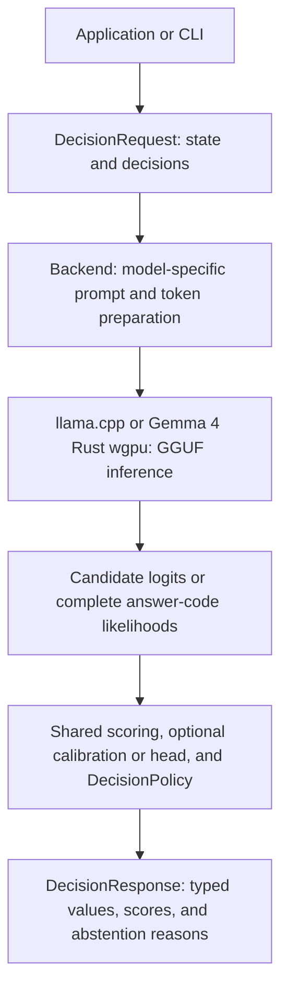

<a id="l2s1-guide"></a>
# L2S1 ガイド

[English](../en/GUIDE.md) · [한국어](../ko/GUIDE.md) · [日本語](GUIDE.md)

[English index](../en/README.md) · [한국어 색인](../ko/README.md) · [日本語索引](README.md)

[英語の紹介](../../README.md) · [한국어 소개](../../README.ko.md) · [記録されたモデル結果](MODEL_RESULTS.md)

詳細なビルド手順、API コントラクト、ランタイム オプション、および検証手順。最初の 判断 への最短パスの README から始めます。

<a id="build"></a>
## ビルドする

純粋な Rust ライブラリは、ネイティブ 推論なしの検証、スコアリング、スカラー 校正、およびワーカーの所有権をサポートします。

```sh
cargo test --locked
```

推論バックエンドと CLI は Linux（CPU または CUDA）、macOS（CPU または Metal）に対応します。edition 2024 に対応する Rust、CMake、C++17 コンパイラーが必要です。Metal ビルドには Metal コンパイラーを含む Xcode ツールチェーンが必要です。ワークスペース依存の `l2s1-llama-sys` は llama.cpp と対応するネイティブブリッジを一緒にビルドします。

```sh
cargo build --release --locked --features llama
# CUDA toolkit required for GPU support:
cargo build --release --locked --features llama-cuda
# macOS with Metal:
cargo build --release --locked --features llama-metal
```

特定のコンピューティング機能用に独立した CUDA ビルドを生成するには、`scripts/build_cuda_arch.sh 86 89` を実行します。各アーキテクチャは、個別の Cargo ターゲット ディレクトリと、対応する ネイティブ ライブラリを備えた `release/run-l2s1` ランチャーを取得します。このスクリプトには、`readelf` および CUDA ツールキットが必要です。 [sm_86 ビルドと共有ステート キャッシュ測定 ](benchmarks/shared-state-cache-20260925/REPORT.md) は、この PR ブランチのフレッシュ ビルドと スモーク を含む、RTX 3080 でチェックされました。他のアーキテクチャ ビルドについては、依然として独自の検証が必要です。

アーキテクチャ ビルド スクリプトは、インストール時に C/C++/CUDA に対して `ccache` を自動的に使用します。既存の `L2S1_NATIVE_COMPILER_LAUNCHER` を尊重します。自動検出を無効にするには、`L2S1_BUILD_CACHE=off` を設定します。 Rust キャッシュを試すには、`RUSTC_WRAPPER=sccache` を明示的に設定します。測定された独立した `sm_86` ビルドでは、`sccache` には個別の Cargo ターゲット ディレクトリ間で Rust ヒットがなかったため、自動的には有効になりません。 Cargo のローカル アーティファクトを再利用するために、ビルドを繰り返しても `L2S1_CUDA_TARGET_ROOT` を安定させます。空の `ccache` を使用すると、最初のビルドが遅くなる可能性があります。一回限りのビルドに採用する前に、[測定されたビルド キャッシュ レポート](benchmarks/build-cache-20260925/REPORT.md)を参照してください。

デフォルトの CPU ビルドは、CMake FetchContent を使用して、llama.cpp リビジョン `3d82ef62d47fd74e18f36c5eccbdcf965b617b17` をダウンロードして検証します。最初のビルドにはネットワーク アクセスが必要です。オフライン ビルドまたは別のリビジョンの場合は、`L2S1_LLAMA_CPP_SOURCE=/path/to/llama.cpp` を設定します。従来の `LLAMA_CPP_DIR` ソース オーバーライドも機能します。 `LLAMA_LIB_DIR` は使用されなくなりました。 ネイティブ コントラクト テストを使用してカスタム リビジョンを検証します。 [検証コマンド](VERIFICATION.md)および[ネイティブ依存関係の詳細](crates/l2s1-llama-sys/README.md)を参照してください。

独立したソース リリースの場合は、`l2s1` より前に `l2s1-llama-sys` を公開します。このビルドには、ローカル Linux および macOS 実行可能ファイルの ネイティブ ライブラリ rpath が埋め込まれます。ダウンストリーム クレートは、ビルド スクリプトで `DEP_L2S1_LIBDIR` を使用して、独自の実行可能ファイルの rpath を設定できます。事前に構築された実行可能ファイルは、ポータブル ローダー パスを含む一致する ネイティブ 共有ライブラリを出荷する必要があります。 `libllama.so` または `libllama.dylib` のみのスワップはサポートされていません。

<a id="dataset-and-benchmark-tools"></a>
### データセットおよびベンチマーク ツール

データの準備、ローカル ベンチマーク オーケストレーション、保存された予測監査、およびレポートの生成では、リポジトリ専用の Rust `l2s1-tools` バイナリが使用されます。 llama.cpp にはリンクしません。推論コマンドは、別途ビルドされた `evaluate_jsonl` サンプルを起動します。モデルのトレーニングと直接の PyTorch プローブは Python ワークフローのままです。

```sh
cargo build --release --locked -p l2s1-tools
target/release/l2s1-tools --help
```

議論と証拠の境界については、[tool コマンド マップ ](crates/l2s1-tools/README.md) および各ベンチマーク ガイドを参照してください。過去の Python アダプターは、アーティファクトの比較とトレーニングのインポートに引き続き使用できます。

モデル ファイルは呼び出し元によって提供されます。適切なテキスト チャット/指示 GGUF を `models/` または別のディレクトリに配置します。 CLI は重みをダウンロードしません。レコード チェックポイント とランタイム ID をロードしています。モデルのロードが成功すると、そのファイルのチェックサムが 1 回計算され、その後のロードのためにファイル ID によってキャッシュされます。絶対 `L2S1_MODEL_HASH_CACHE_DIR` を設定してキャッシュを再配置するか、そのエントリを削除して新しいチェックサムを強制します。

<a id="the-decision-contract"></a>
## 判断 契約

リクエストは JSON `state` と 1 つ以上の判断を共有しました。各 判断 は、ID、命令、およびその出力種類を提供します。

| 種類 | 定義 | 結果 |
| --- | --- | --- |
| `binary` | 偽と真 判断基準 | `p_true` およびオプションのブール値 |
| `choice` | セマンティック オプション ID と 判断基準 | オプションで選択されたオプション ID |
| `ordinal` | 数値が厳密に増加する順序付けされたレベル | 期待値とオプションの選択レベル ID |

たとえば:

```json
{
  "state": { "storage_requirement": "chilled" },
  "decisions": [
    {
      "id": "storage_zone",
      "instruction": "Select the storage zone matching storage_requirement.",
      "kind": {
        "type": "choice",
        "options": [
          { "id": "ambient", "criterion": "Ambient storage is required." },
          { "id": "chilled", "criterion": "Chilled storage is required." },
          { "id": "frozen", "criterion": "Frozen storage is required." }
        ]
      }
    }
  ]
}
```

L2S1 は、これらのセマンティック ID を応答コードにマップし、モデルの実際のアシスタント応答境界でトークン化をチェックします。 26 オプションまでは、元の `A` ～ `Z` 単一トークン パスを保持します。より大きな候補セットでは、固定幅コード (`AA` ～ `ZZ`、`AAA` ～ `ZZZ` など) が自動的に使用されます。コードが複数のトークンにまたがる場合、完全なコード シーケンスの可能性がスコアリングされます。アプリケーションは、選択された値として、モデル固有のコードではなく、`chilled` を受け取ります。トークン パスと生のスコアは証拠として引き続き利用可能です。 「[回答コードの拡張と意図の評価」](INTENT_BENCHMARK.md)を参照してください。

各 判断 は個別に評価されます。リクエストには、同じ状態に対して異なる 判断 種類を含めることができます。これは、後の質問が前の回答を参照する会話としてエンコードされません。 3 種類すべてについては、[`examples/warehouse.json`](../../examples/warehouse.json) を参照してください。

Rust 呼び出し元は、型指定された `Level` 値を使用して、`Decision::ordinal(id, instruction, levels)` で 順序付き 判断を構築できます。 `ComputeOptions::default()` は、CLI のデフォルト (2048 コンテキスト、 256 バッチと ubatch、4 つのスレッド、flash attention オフ、自動モデル読み込み、および明示的な GPU レイヤー オーバーライドなし) を使用します。

<a id="scores-and-abstention"></a>
### スコアと判断保留

ネイティブ 候補 logits `z` の場合、L2S1 は 2 つの個別の量を計算します。

```text
option_probability[i] = exp(z[i] - logsumexp(candidate logits))
candidate_mass        = exp(logsumexp(candidate logits) - logsumexp(all vocabulary logits))
```

`option_probability` は、提供されたオプションを比較します。 `candidate_mass` は、モデルの次のトークンの確率がそれらのオプションにどの程度属するかを測定します。 候補間の相対 の確率が高いだけでは、信頼できる答えは確立されません。

デフォルトの `DecisionPolicy` は最上位候補確率 **0.8 以上**、候補質量 **0.05 以上**、最上位候補間で同点なしを要求します。満たさなければ選択は `null` となり、`abstention_reasons` が理由を示します。スコアは返します。順序付きの期待値は確率で重み付けしたレベル値で、選択を保留しても利用できます。

これらはモデルのスコアであり、普遍的な正しさの確率ではありません。部分的な上位 k 応答またはモデルによって生成された数値推定は、正確な ネイティブ 証拠契約を満たしていません。

<a id="inspect-validate-and-run"></a>
## 検査、検証、実行

構築後、リクエストを読まずにモデルを検査します。

```sh
./target/release/l2s1 \
  --model models/SmolLM2-135M-Instruct-Q8_0.gguf --inspect
```

実際のリクエストのテンプレート、候補トークン、コンテキストの使用状況、実行サポート、およびフォワード パスを使用しないアクティブなアーティファクト バインディングを確認します。

```sh
./target/release/l2s1 \
  --model models/SmolLM2-135M-Instruct-Q8_0.gguf \
  --input examples/warehouse.json --preflight
```

いずれかの互換性のあるモデルで同じリクエストを実行します。

```sh
./target/release/l2s1 \
  --model models/SmolLM2-135M-Instruct-Q8_0.gguf \
  --input examples/warehouse.json

./target/release/l2s1 \
  --model models/Qwen3-0.6B-Q8_0.gguf \
  --input examples/warehouse.json
```

リクエストと結果のスキーマは変わりません。各モデルは独自のトークナイザーとプロンプト プロファイルを使用します。自動選択では、互換性のある高密度 Qwen3 チェックポイントには Qwen3 の非思考プロファイル、GPT-OSS には Harmony 最終プリフィル、および他のサポートされているモデルには埋め込み GGUF Jinja テンプレートが使用されます。

CPU がデフォルトです。 GPU 推論には、`--device cuda` または `--device metal` を明示的に選択します。選択したデバイスが利用できないか、サポートされていないモデルではエラーが発生します。サイズが大きすぎる入力は切り捨てられずに拒否されます。 `--context`、`--batch`、`--ubatch`、`--threads`、および `--flash-attention off|auto|on` は、要求されたコンピューティング設定を制御します。 `--input -` は stdin を読み取り、通常の結果は stdout に送られ、ネイティブ ログは stderr に送られます。 macOS では、Metal を選択する前に、`--features llama-metal` を使用してビルドします。 ネイティブ ログはデフォルトで `L2S1_LOG=warn` を使用します。冗長性を変更するには、`error`、`info`、`debug`、または `off` を設定します。

`--diagnostics` を追加すると、通常の応答、モデル ID、プロンプト トークン フィンガープリント、要求された/有効な実行モード、フォールバック理由、校正 ID、および要求ローカル タイミングが含まれる別のエンベロープを受信します。通常の `decide()` 応答は、既存の形状を保持します。 `--preflight` または `--diagnostics` でのリクエスト段階の失敗には、構造化された JSON とゼロ以外の終了ステータスがあります。モデルの読み込みまたは不正な形式の JSON は、そのエンベロープの前で失敗する可能性があります。

<a id="rust-integration"></a>
## Rust統合

`LlamaBackend` を使用するには、クレートの `llama` 機能を有効にします。

`DecisionRequest`、`Decision`、`DecisionKind`、`OptionSpec`、および `Level` を使用してリクエストを直接構築します。 JSON ファイルの解析は必要ありません。完全な [Rust ウェアハウスの例 ](../../examples/warehouse.rs) は、モデルを使用せずにバイナリ、選択肢、および 順序付き の判断を構築および検証します。

```sh
cargo run --locked --example warehouse
```

呼び出し元は、別のモデル パスを渡しながら、リクエストを変更せずに維持できます。

```rust
use std::path::Path;
use l2s1::{
    DecisionBackend, DecisionPolicy, DecisionRequest, DecisionResponse,
    llama::LlamaBackend,
};

fn decide_with_model(
    model: &Path,
    request: &DecisionRequest,
) -> l2s1::Result<DecisionResponse> {
    let mut backend = LlamaBackend::load(
        model, 2048, 256, 4, false, DecisionPolicy::default(),
    )?;
    backend.decide(request)
}
```

繰り返しリクエストには、呼び出しごとに読み込まず、バックエンドを保持します。`inspect()`、`preflight()`、`decide_detailed()` は、それぞれ確認、検証、診断の API を公開します。`decide_batch()` は独立したリクエストを受け付け、結果のグループ分けを維持します。

`BackendWorker::spawn()` は、その所有者スレッド上に バックエンド を構築します。その工場では、非送信/非同期 `LlamaBackend` を返すことができます。 ネイティブ コンテキストがスレッド間で移動することはありません。ワーカーは、キューに入れられたリクエストの数とシリアル化されたリクエストのサイズを制限し、オペレーターが推定したメモリ バジェットを予約し、満杯のキューを直ちに拒否し、許可された作業に対して `DecisionTicket` を返します。 `close()` は作業をドレインし、同じスレッド上の バックエンド を削除します。予約はオペレーティング システム RSS ではなく、入場を制御します。 「[worker の使用法とライフサイクル」](MODEL_INTERCHANGEABILITY.md#bounded-ownership-and-scheduling) を参照してください。

Metal で、`BackendWorker::close()` を呼び出し、プロセスが終了する前に、その所有者スレッドが `LlamaBackend` を解放するのを待ちます。直接ユーザーは、終了する前に `LlamaBackend` をドロップする必要があります。これにより、モデルがロードされたままの場合、llama.cpp Metal ティアダウン アサーションが回避されます。

`BackendWorker::spawn_batched()` はさらに、明示的なリクエスト数、モデル入力トークン、およびコレクション待機制限に基づいてリクエストを収集します。 `LlamaBackend` の場合、ネイティブ バッチ処理には `ExecutionMode::Parallel` を選択する必要があります。他のモードではリクエストはシリアルに保持されます。収集だけでは推論は並列化されず、既存の並列スコア ドリフト制限が引き続き適用されます。

<a id="optional-prompt-detail-and-answer-code-mixtures"></a>
### オプションのプロンプトの詳細と応答コードの組み合わせ

`--prompt-detail minimal` および `--code-rotation 0` は既存のプロンプトを保持し、デフォルトのままになります。 `typed` は、判断 種類、セマンティック オプション ID、順序付き 値、および正確な比較ガイダンスを追加します。 `typed-examples` は、入力の前に一般的な数値間隔の例も追加します。これらのバリアントはモデル中立性を保ち、スキーマの変更を受け入れ、予測やコンテキストの使用法を変更できます。 正解率 が保証する測定値ではありません。

```sh
./target/release/l2s1 --model models/Qwen3-0.6B-Q8_0.gguf \
  --input examples/warehouse.json --prompt-detail typed-examples --code-rotation 1
```

回転によりコード割り当てが変更されます。表示位置 `i` は正規オプション `(i + rotation) % option_count` を表します。 バックエンド は、非負の回転を受け入れ、それらをオプション数を法として減らし、元の 順序付き スケールを含む元のセマンティック順序でスコアを返します。返されるコードとトークン ID は、実際のローテーションされた割り当てを示します。対応する Rust セッターは、`set_prompt_detail(PromptDetail::TypedExamples)` および `set_code_rotation(1)?` です。どちらかを変更すると、準備キャッシュがクリアされ、プロンプト ID が変更されるため、キャリブレーションとヘッドはその構成と一致する必要があります。デフォルトの応答 JSON は、追加された詳細/回転フィールドを省略します。

複数の回転パスの場合、`score_semantic_mixture(&decision, &passes, &policy)` はセマンティック オプション ID によって結果を整列し、**完全な候補確率** をプールします。

```text
q(y)                    = mean(candidate_mass[pass] * option_probability[pass][y])
mixture candidate_mass  = mean(candidate_mass[pass])
mixture option_probability[y] = q(y) / sum(q)
```

これにより、マス ゲートが 1 に設定されるのではなく、保持されます。少なくとも 2 つの未校正の ネイティブ パスを受け入れます。 learning-ヘッド、調整済みで以前に混合された結果は拒否されます。呼び出し元は同じモデル、状態、タスク、推論構成を使用し、コード ローテーションのみを変更する必要があります。混合スコアは、正しさの校正された確率ではありません。結果は `semantic_probability_mixture_v1` とマークされます。その `raw_logit` は `ln(q)` で、コード/トークンのメタデータは最初のパスを表し、トークン数はすべてのパスの合計です。パスを追加すると、推論時間がさらにかかります。

[ペアの評価例](../../examples/evaluate_accuracy.rs)は、`id`、オプションの`group`、および1つの判断を含む`request`を含むJSONLレコードに対してこれらのバリアントを実行します。

```sh
cargo run --release --locked --features llama --example evaluate_accuracy -- \
  --model models/Qwen3-0.6B-Q8_0.gguf --input cases.jsonl \
  --output /tmp/l2s1-accuracy-passes.jsonl \
  --prompt-details minimal,typed,typed-examples --all-rotations
```

出力は新しいものである必要があります。評価者は、応答ラベルを読み取ることなく、ネイティブ パス、混合結果、構成 ID、およびタイミングを記録します。バリアントを選択する前に、差し出されたラベルでタスク 正解率 と承認 採用率 を個別に評価します。

<a id="direct-image-input-and-http-api"></a>
## 直接画像入力とHTTP API

ビジョン対応チャット GGUF を、対応するマルチモーダル プロジェクター GGUF (`mmproj`) とともにロードします。プロジェクターは、llama.cpp `libmtmd` を通じて静止画像をエンコードします。次に、L2S1 は、結果の次のトークン logits から同じ型付きオプションをスコア付けします。 `LlamaBackend::load_vision_projector(path)` および `LlamaBackend::decide_vision(&request, image_bytes)` は、Rust API を公開します。 `LlamaBackend::decide_vision_batch(&requests, &images)` は、各リクエストの状態とイメージを独立させます。既存のテキスト リクエストは引き続き `decide` を使用します。

オプトイン HTTP リスナーは、`POST /v1/decisions` で JSON を受け入れ、`GET /healthz` で準備状況を報告します。

```sh
cargo run --release --locked --features llama-cuda -- \
  --model /models/vision-model.gguf --mmproj /models/mmproj.gguf \
  --device cuda --context 4096 --listen 127.0.0.1:8080
```

バージョン管理された API は、`media` という名前の共有 `state` と判断を受け入れます。テキストの `media` を省略します。各 判断 は、画像を選択するために `media_ids` を設定できます。省略するとすべての画像が選択され、`[]` では何も選択されません。応答には常に `api_version`、`request_id`、`backend`、`policy`、および `results` が含まれます。すべての結果には `id`、型付き `value`、`status`、`abstention_reasons`、`evidence`、および `usage` が含まれます。ローカル証拠には、スコア付きの `type: "model_scored"` と 候補の確率質量 があります。 OpenRouter の証拠には `type: "selection_only"` があり、発明された確率はありません。ローカルの `policy` が設定されます。リモート `policy` は `null` です。 `GET /v1/capabilities` を使用して、ロードされたモデル、サポートされている画像入力、証拠の種類、および制限を検査します。

```json
{
  "state": {"task": "identify the object"},
  "media": [
    {"id": "front", "type": "image", "data_base64": "..."},
    {"id": "side", "type": "image", "data_base64": "..."}
  ],
  "decisions": [{
    "id": "object", "instruction": "Choose the main object",
    "kind": {"type": "choice", "options": [
      {"id": "box", "criterion": "a box"},
      {"id": "bag", "criterion": "a bag"}
    ]},
    "media_ids": ["front"]
  }]
}
```

選択のみの応答には、ローカル応答と同じ結果エンベロープがあります。

```json
{
  "api_version": 1,
  "request_id": "req-1",
  "backend": {"runtime": "openrouter-chat-completions", "model": "example/model", "details": null},
  "policy": null,
  "results": [{
    "id": "object", "value": {"type": "choice", "selected": "box"},
    "status": "selected", "abstention_reasons": [],
    "evidence": {"type": "selection_only", "selected_code": "A", "provider_model": "example/model"},
    "usage": {"input_tokens": 42, "output_tokens": 1}
  }]
}
```

既存のテキスト リクエストの場合、このコマンドは 1 つの画像を添付します。

```sh
jq --arg image "$(base64 -w0 photo.jpg)" '. + {media: [{id: "photo", type: "image", data_base64: $image}]}' \
  examples/warehouse.json | \
  curl -sS -H 'Content-Type: application/json' --data-binary @- \
  http://127.0.0.1:8080/v1/decisions
```

ライブラリは、base64 を使用しないオリジナルのイメージ バイトを引き続き受け入れます。 CLI に相当するのは `--mmproj /models/mmproj.gguf --image photo.jpg --input request.json` です。ローカルの llama.cpp および wgpu バックエンドは、判断 ごとに 1 つのイメージを受け入れます。 OpenRouter アダプターは、選択したプロバイダー モデル独自の制限に従って、判断 ごとに最大 4 つのイメージを受け入れます。画像バイトはそれぞれ 8 MiB に制限され、各リクエストは 128 判断に、HTTP 本体は 44 MiB に制限されます。無効なメディア参照または バックエンド 制限は、推論の前に失敗します。 26 を超えるオプションでは、固定幅の応答コードが使用されます。ローカル ビジョンは 全語彙 スコアリングを使用します。 llama.cpp ビジョンは、多くても 26 オプションの完全またはコンパクトな証拠とともに、フレッシュまたはオプトインの並列実行を受け入れます。出力ヘッド、スカラー 校正、およびイメージ リクエストのプレフィックス再利用/状態復元モードを拒否します。平行ビジョンは現在、判断 ごとに最大 26 オプションをサポートしています。より幅広い応答コードに対しては、新たな実行を使用します。 Gemma 4 wgpu ビジョンは、リクエストローカルのプレフィックスの再利用と状態の復元を受け入れます。リスナーは、16 リクエスト推論キューと 192 MiB インフライト ボディ バジェットを使用して、最大 32 接続を受け入れます。ローカル推論所有者は、HTTP リクエストをシリアルに処理します。 llama.cpp の並列実行により、1 つのリクエスト内で独立したイメージの判断をバッチ処理できます。接続スロットが残っている場合、推論がビジーである間、ヘルスおよび機能のリクエストは応答し続けます。ループバックにバインドするか、リモート クライアント用にその前に認証されたリバース プロキシを配置します。エラーには、`error.code`、`error.message`、および `error.request_id` があります。

追加の Rust バックエンドは、`HttpDecisionBackend::capabilities` および `decide_json` を実装します。コントラクト層は、応答を送信する前に、結果 ID と共通の結果フィールドを検証します。 バックエンド は、共有 `value` および `status` フィールドを変更せずに、その `evidence.type` の下に証拠フィールドを追加できます。

ネイティブ イメージのバッチ処理の場合は、`--execution-mode parallel --parallel-width 4` および一致する `--mmproj` を使用して llama.cpp リスナーを起動します。 1 つのリクエストで 4 つのメディア アイテムを送信し、それぞれの独立した 判断 に独自の `media_ids: ["image_id"]` を与えます。ランタイムは、互換性のあるプロジェクター チャンクをバッチでエンコードし、独自のデコーダー シーケンスと KV ストリームで各画像プロンプトを評価します。リクエストのグループ化だけではこれを実現できません。 `GET /v1/capabilities` は、並列イメージ実行が有効かどうかを報告します。並列応答には、最新の ネイティブ wave のプロジェクターおよびデコーダー カウンターを備えた `backend.details.vision_batch` が含まれます。通常の `fresh` のデフォルトでは、以前のシリアル動作が保持されます。並行スコアリングは新規スコアリングとは異なる場合があるため、ターゲット モデルの判断と確率を比較してください。 `--parallel-context-dynamic` は、ウェーブの最長のイメージ プロンプトとトークン バッチのヘッドルームに合わせて、各 KV ストリームのサイズを設定します。 ネイティブ スケジューラーが安全にバッチ処理できないプロジェクター レイアウトは、明示的なエラーを返します。

ネイティブ ビジョン バッチ処理は、最大 26 応答オプションを持つ、互換性のある非リカレント、非ハイブリッド ビジョン モデルでサポートされている実行オプションです。 [TrashNet バッチ 4 測定 ](benchmarks/trashnet-vision-20260925/REPORT.md#native-four-image-batching-2026-09-26) では、実際のデコーダーのバッチ処理が検証され、RTX 3080 での処理時間が短縮されましたが、テストされた 3 つの CUDA チェックポイントはすべて、既存の数値等価性 判断基準 に失敗しました。スコアと判断の保存が必要な場合は、最新の実行を維持します。

Gemma は可能性のあるビジョンです。 バックエンド: Gemma 3 4B/12B/27B および Gemma 4 E2B/E4B には、llama.cpp のイメージ対応バリアントがあります。 Gemma 3 1B はテキストのみです。ビジョン チェックポイント を、対応する `mmproj` とペアにします。テキストのみの GGUF ファイルだけではピクセルを受け入れることができません。 [llama.cpp マルチモーダル モデル リスト ](https://github.com/ggml-org/llama.cpp/blob/master/docs/multimodal.md) および [Gemma 3 ビジョン ガイド ](https://github.com/ggml-org/llama.cpp/blob/master/docs/multimodal/gemma3.md) を参照してください。

Gemma 4 と 2 つのラベル付き画像テストデータを使った CPU/CUDA のレイテンシ測定は、[画像の直接推論ベンチマーク](VISION_BENCHMARK.md)を参照してください。HTTP 画像 API による 30 クラス・150 画像の CUDA 実行は [Caltech-101 ベンチマーク](benchmarks/caltech101-vision-20260924/README.md)を参照してください。両方の回答順序による 70 画像の猫・犬の検証は、[猫と犬の画像レポート](benchmarks/cats-dogs-vision-20260924/REPORT.md)を参照してください。過去の HTTP リクエスト形式を記録しており、一般的な画像正解率は主張しません。6 クラスの廃棄物分類と、プロンプト・採用しきい値を対応付けた評価は [TrashNet 画像ベンチマーク](benchmarks/trashnet-vision-20260925/REPORT.md)を参照してください。

<a id="openrouter-adapter"></a>
## OpenRouterアダプター

プロセス環境で `OPENROUTER_API_KEY` を設定し、要求されたモダリティを受け入れる [OpenRouter モデル ](https://openrouter.ai/models) を選択します。オプションの実行可能ファイルは、ネイティブ llama.cpp バックエンド をビルドしません。たとえば、`prism-ml/ternary-bonsai-2-27b` はテキストと画像を受け入れます。地元の盆栽 27B Q1_0 GGUF とは異なる チェックポイント です。

```sh
cargo run --release --locked --no-default-features --features openrouter \
  --bin l2s1-openrouter -- \
  --model prism-ml/ternary-bonsai-2-27b --reasoning-effort none \
  --input examples/warehouse.json
```

CLI 上の 1 つのイメージに対して、`--image photo.jpg` を追加します。アダプターは、8 MiB までの PNG、JPEG、GIF、および WebP を受け入れます。 HTTP を提供するには、`--input ...` を `--listen 127.0.0.1:8081` に置き換えます。リスナーは、`POST /v1/decisions`、`GET /v1/capabilities`、および `GET /healthz` を公開します。最大 4 つのリモート HTTP リクエストを並行して実行します。同じメディア選択による判断も、最大 4 つの並列完了のバッチで送信されます。 `--max-tokens` は、判断 ごとの完了制限を設定します (デフォルトは 1024、最大値は 4096)。 `--reasoning-effort` はオプションであり、要求された場合にのみ渡されます。選択したモデルでサポートされている値を使用してください。

周囲の空白を削除した後、コードは正確に一致する必要があります。不正な形式または不完全なモデル出力は禁止されます。固定幅コードは、26 を超えるオプションをサポートします。リモート応答には `scores`、`candidate_mass`、`top_option_probability`、`p_true`、または 順序付き の期待値がなく、ローカル確率ポリシーは適用されません。 順序付き の結果には、選択したレベルの `level_value` が含まれます。プロバイダーまたはトランスポートの障害により、HTTP 502 が返されます。モックサーバー テストではアダプターをチェックします。ライブ OpenRouter リクエストには API キーが必要です。プロバイダーのイメージとリクエストの制限は選択したモデルに依存するため、`GET /v1/capabilities` はアダプターの制限を報告し、プロバイダーの制限をモデル依存としてマークします。

<a id="optional-wgpu-backend"></a>
## オプションの wgpu バックエンド

`wgpu` 機能は、固定された [rullama-engine](https://github.com/Brainwires/rullama-framework/tree/main/engine/rullama-engine) Gemma 4 テキストおよびビジョン実装を使用します。 Gemma 4 テキスト GGUF を単独で、または対応する `mmproj` GGUF とともに受け入れます。ストリーミング アダプターは、ペアになったファイルを 1 つの仮想 GGUF としてエンジンに公開します。モデルの重みは元のファイルから読み取られます。 GPU 推論と画像エンコードでは、Rust wgpu を使用します。この機能には wgpu GPU アダプターが必要で、`--allow-software-adapter` が開発用に明示的に設定されていない限り、ソフトウェア Vulkan アダプターは拒否されます。 ネイティブ Metal アダプターを適用するには、macOS で `WGPU_BACKEND=metal` および `--require-metal` を設定します。 Gemma 4 E2B Q8_0 ペアは、ソフトウェア wgpu を通じてローカルでチェックされています。 ネイティブ GPU 品質とその他の チェックポイント サイズはまだ検証が必要です。

```sh
cargo run --release --locked --features wgpu --bin l2s1-wgpu -- \
  --model /models/gemma-4-E2B-it-Q8_0.gguf \
  --mmproj /models/mmproj-gemma-4-E2B-it-Q8_0.gguf \
  --image photo.jpg \
  --input examples/warehouse.json
```

テキスト判断の場合は、`--mmproj` および `--image` を省略します。 `--listen 127.0.0.1:8080` を追加して、以下で説明する同じ `POST /v1/decisions` および `GET /healthz` API を提供します。ビジョンリクエストについては、`media` を送信してください。画像は最大 25 メガピクセルまでデコードされ、ビジョン エンコーダーの 48 ピクセル グリッドに合わせて、長辺が最大 432 ピクセルにサイズ変更されます。 wgpu パスは、バイナリ、選択、および 順序付き の判断に対する 全語彙 質量および完全なマルチトークン応答コードをスコアします。 CLI での `--snapshot-limit-bytes` および `--diagnostics` を使用した、リクエストローカルの `fresh`、`prefix-reuse`、および `state-restore` の実行をサポートします。マルチトークンの応答コードでは、新しい評価が使用されます。 `parallel`、LoRA、出力ヘッド、およびスカラー 校正 は、以下の汎用 llama.cpp パスを使用します。 GPU スコアは llama.cpp とは異なる場合があります。調整された確率として扱う前に、各モデルとタスクを検証します。

このペアの GGUF アダプターは Gemma 4 に固有であり、Qwen モデル/プロジェクター ファイルを拒否します。 Bonsai、Qwen、SmolLM、およびその他の互換性のある GGUF チャット モデルの場合は、既存の llama.cpp バックエンド を使用します。選択した GGUF のトークナイザーとチャット テンプレートを読み取り、同じ型の 判断 および HTTP API を公開します。 CUDA ビルドは NVIDIA GPU をサポートします。 `llama-metal` ビルドは、macOS 上の Apple Metal をサポートします。

```sh
cargo run --release --locked --features llama-cuda -- \
  --model /models/Qwen3-0.6B-Q8_0.gguf \
  --device cuda --input examples/warehouse.json

# macOS
cargo run --release --locked --features llama-metal -- \
  --model /models/Qwen3-0.6B-Q8_0.gguf \
  --device metal --input examples/warehouse.json
```

`--model` を変更して、互換性のある別の GGUF をロードします。テキスト モデルにはモデル ファイルのみが必要です。サポートされているビジョン モデルの場合は、一致する `--mmproj` ファイルを指定し、CLI または HTTP API を介して画像を送信します。 llama.cpp Metal パスは、既存の出力ヘッド、LoRA、校正、実行モード、および HTTP コントラクトを保持します。各モデルには、独自の バックエンド インスタンスとタスク品質評価が必要です。このルートには、FlareLLM または Qwen-specific Rust wgpu アダプターは必要ありません。 [2 モデル CUDA スモーク 測定 ](benchmarks/gguf-cuda-20260925/README.md) は、モデルのアイデンティティ、判断、判断保留、およびタイミングを記録します。 Metal のパフォーマンスは確立されません。

| Metal 実行経路 | GGUF モデル | 画像 | 実行 | 追加機能 |
| --- | --- | --- | --- | --- |
| Rust wgpu | Gemma 4 | 一致する Gemma 4 `mmproj` | フレッシュ、プレフィックス再利用、状態復元。マルチトークンコードはフレッシュを使用します | 同じ型の CLI と HTTP の判断 |
| llama.cpp | 固定された llama.cpp リビジョンでサポートされるモデル (互換性のある Bonsai および Qwen GGUF を含む) | `mmproj` と一致するサポート対象モデル | 既存のフレッシュ、プレフィックス再利用、状態復元、並列コントラクト。ビジョンはフレッシュとオプトインを並行してサポートします | LoRA、校正、出力ヘッド、診断、HTTP |

`wgpu` 実行可能ファイルは `parallel` を拒否します。必要な場合は、llama.cpp Metal ルートを使用します。実際の Metal 推論と結果の同等性を検証するには、互換性のあるモデル ファイルを備えた Mac が必要です。

<a id="optimized-vision"></a>
## 最適化された視力

`--vision-optimized` を CUDA または Metal 呼び出しに `--model` および `--mmproj` とともに追加して、互換性のあるビジョン スループット設定を有効にします: 4 つの独立したデコーダー/KV ストリーム、動的コンテキスト予約、トークン バッチ/マイクロバッチ1024、Flash Attention、コンパクトな証拠、8 MiB 制限付き準備キャッシュ、および同一のプロジェクター埋め込みのリクエストローカル再利用。再利用を有効にすると、各固有の画像チャンクが独立してエンコードされ、他の画像スコアが分離されます。デフォルトの並列パスでもプロジェクター チャンクをバッチ処理できます。デフォルトのコンテキストは質問ごとに 4096 です。 `--context`、スレッドとレイヤーの配置は引き続き明示的に調整できます。個別の最適化フラグは、部分的なプロファイルがサイレントに選択されることを避けるために、このプロファイルと競合します。 GPU/カーネルのサポートが必要です。 Metal のパフォーマンスは未検証です。

Rust の場合、`ComputeOptions::vision_optimized()` を使用して バックエンド を構築し、一致するプロジェクターをロードして、`backend.enable_vision_optimizations()?` を呼び出します。常駐 バックエンド は、準備されたプロンプトを保持します。画像の埋め込みは、1 つの ネイティブ ウェーブ内でのみ再利用されます。候補者マス ゲートでは依然として完全な語彙が使用されます。 ネイティブ メモリがすでにクリーンな場合、重複 KV のクリアはグローバルにスキップされます。 Rust のみの障害と ネイティブ 障害は依然として状態を無効にします。

正確な準備のキャッシュ、コンパクトな証拠の転送、およびダーティのみの KV クリアは、このプロファイルのコンポーネントです。分離されたチェックでは、変更されていないコンピューティング構成でスコアが保持されます。それらを並列デコードと組み合わせても、Flash Attention は予測を変更します。シリアル コンポーネントの実験では高速化は確立されませんでした。このプロファイルは、互換性のある GPU ビジョン モデルでサポートされています。デコーダー/プロジェクターのバッチ形状とアテンション カーネルによって予測が変わる可能性があります。非リカレント、非ハイブリッド モデルと、最大で 26 の回答オプションをサポートします。プレフィックスの再利用/共有状態のセッションとスナップショットの復元は、別個の実行戦略のままです。独立したイメージは、イメージの KV 状態を共有できません。 [TrashNet 測定値 ](benchmarks/trashnet-vision-20260925/REPORT.md) を参照してください。

<a id="model-specific-identity-and-calibration"></a>
## モデル固有の ID と 校正

`ModelIdentity` は、チェックポイント、埋め込みテンプレート、有効なプロンプト プロファイル/バージョン、ランタイム ビルドとロードされたライブラリ、アクティブなアダプター/ヘッド、デバイス ラベル、およびコンピューティング/実行構成のフィンガープリントを作成します。 `preflight()` は、その ID と実際のリクエストのチェックを組み合わせます。能力検査により、利用可能な操作が確立されます。ラベル付き評価によりタスクの品質が確立されます。

オプションのスカラー温度 校正 は、オプションの順序と 順序付き 値を含む、モデル/構成のフィンガープリントと正確なタスク署名にバインドされます。バインディングを変更すると、アーティファクトは別のモデルに適用されずに拒否されます。 校正 は生の logits とベース 候補の確率質量 を保持しますが、受け入れ確率と 採用率 は変更される可能性があります。

```sh
cargo run --release --locked --example fit_calibration -- \
  fit-input.json task-temperature.json

./target/release/l2s1 \
  --model models/SmolLM2-135M-Instruct-Q8_0.gguf \
  --input examples/warehouse.json \
  --calibration task-temperature.json --diagnostics
```

[キャリブレーション入力スキーマおよび評価契約](MODEL_INTERCHANGEABILITY.md#scoped-scalar-calibration)は、測定された生のスコア記録、独立したソースグループ、ホールドアウトされたNLL/Brierおよびポリシー採用率チェックを記述します。トレーニング済みの 校正 はバンドルされていません。複数のタスク スコープのアーティファクトを登録できますが、スカラー 校正 を出力 ヘッド とスタックすることはできません。

互換性のある GGUF LoRA は、`--lora` とともにロードできます。学習されたタスク固有のスコアラーは、`--output-head` でロードできます。現在、非表示機能のヘッドには Gemma4 が必要で、ヘッドには記録された新しい実行構成が必要です。これらはオプションの専門化です。 [LoRA トレーニング](DECISION_FINETUNE.md) および [output-ヘッド 契約](OUTPUT_HEAD.md) を参照してください。

<a id="execution-and-memory"></a>
## 実行と記憶

| `--execution-mode` | 動作 | 状態 |
| --- | --- | --- |
| `fresh` | 空のシーケンス状態からすべての 判断 を評価します | デフォルト |
| `prefix-reuse` | 1 つのリクエスト内で正確な共通トークン プレフィックスからの完全な事前入力バッチを再利用します。 | オプトイン;リカレント/ハイブリッド メモリが新しいメモリにフォールバックします |
| `state-restore` | 共通プレフィックスのシーケンス全体の状態を保存し、後の独立したサフィックスのためにそれを復元します。 | サポートされており、オプトイン。テスト済みのハイブリッド盆栽 GGUF で動作します |
| `parallel` | 共有プレフィックスプレフィルを使用して、独立した質問を分離されたシーケンスにバッチ処理します。 | サポートされています。リカレント/ハイブリッド モデルを拒否し、スコアを変更する可能性があります |

デフォルトのプロンプト レイアウトは `legacy` です。 `--prompt-layout state-first` は共有状態をより早く配置し、より長い再利用可能なプレフィックスを公開できますが、プロンプトも変更され、予測も変更される可能性があります。

```sh
./target/release/l2s1 --model models/Qwen3-0.6B-Q8_0.gguf \
  --input examples/warehouse.json \
  --prompt-layout state-first --execution-mode state-restore \
  --snapshot-limit-bytes 268435456 --diagnostics
```

状態の復元は、デフォルトでスナップショット バッファーを 256 MiB に制限し、スナップショットが使用できない場合は新しいフォールバックを報告します。それには完全な証拠の移転が必要です。再帰/ハイブリッド モデルでは `prefix-reuse` が依然としてフレッシュにフォールバックするため、明示的に `state-restore` を使用してください。 `--parallel-width` は、並列ウェーブごとに質問を制限し、コンテキスト メモリを増やします。通常のリクエストは、リクエスト境界およびエラー後に ネイティブ KV 状態をクリアします。スナップショットは、ネイティブ 呼び出しから存続することはありません。スナップショット制限もワーカー予約も、プロセス全体のメモリ制限ではありません。

`--parallel-context-dynamic` は、その Wave の実際の入力トークンとヘッドルームの 1 つのバッチから各並列 KV コンテキストのサイジングを選択します。 `--context` は質問ごとの入力制限のままです。コンテキストは、後のウェーブが大きくなるにつれて増加し、同じ有効な質問数で最大の割り当てが維持されます。応答レポート `backend.parallel_context_tokens`;コンテキスト サイズを変更するとスコアが変わる可能性があるため、ターゲット モデルで 判断 の同等性を確認してください。

状態のコピーにはコストがかかり、高速化は保証されません。 [Bonsai RTX 3060 検証](benchmarks/bonsai-state-restore-20260925/REPORT.md) は、固定 16-判断 フィクスチャー 上で実際のハイブリッド モデルの再利用と正確な新しい結果のパリティを記録します。並列実行により、いくつかのチェックポイントでの確率と上位選択の違いが測定されました。どちらも明示的なオプションのままです。 [実行の詳細](MODEL_INTERCHANGEABILITY.md#request-local-state-restoration)および[並列実行](PARALLEL_EXECUTION.md)を参照してください。

<a id="optional-preparation-and-evidence-optimizations"></a>
### オプションの準備と証拠の最適化

VRAM より大きいモデルの場合、CUDA ロードは `--gpu-layers N` または `--cpu-moe-layers N` を受け入れて、重みの一部を CPU RAM に配置します。配置はコンピューティング ID に記録され、数値スコアが変更される可能性があります。 [CPU/GPU 配置](MODEL_INTERCHANGEABILITY.md#cpugpu-placement) を参照してください。

低モデル読み込みピーク プロセス RSS の場合は、`--model-load-mode read` を使用します。 [ロード動作と測定制限](MODEL_INTERCHANGEABILITY.md#model-loading-and-peak-host-rss)を参照してください。

従来のプロンプト、新規実行、完全な証拠の転送、および無効化された準備キャッシュはデフォルトのままです。既存の反復リクエストと修正された 判断 スキーマは引き続き機能します。これらのオプションはいずれも固定スキーマを必要としません。

```sh
./target/release/l2s1 --model models/Qwen3-0.6B-Q8_0.gguf \
  --input examples/warehouse.json --evidence-transfer compact \
  --preparation-cache-bytes 8388608 --preparation-cache-entries 128
```

- **準備キャッシュ:** は、ロードされた 1 つの バックエンド 内に正確に準備されたプロンプトと回答境界候補マッピングを保持します。 `PreparationCacheConfig` は、キャッシュごとのエントリを制限し、エントリ間で 1 バイトの割り当てを分割します。スコアや KV 状態ではなく、トークンの準備を保存します。新しい状態とスキーマは通常の準備パスを使用します。 バックエンド が常駐している場合、繰り返し呼び出しが最も効果的です。
- **コンパクトな証拠:** は、ネイティブ ホストから Rust logits の完全なコピーを回避しながら、候補 logits と 全語彙 ノーマライザーを保持します。 llama.cpp は引き続き完全な語彙を計算し、ホスト上で利用できるようにします。これは、GPU 側の削減または出力 ヘッド の削除ではありません。学習された出力 ヘッド を使用せずに、テキストのフレッシュ/プレフィックス再利用とイメージのフレッシュ/並列実行をサポートし、明確な 校正 ID を持ちます。
- **明示的な共有状態:** `backend.shared_state(state)?` は、`PrefixReuse` 用に構成された バックエンド を借用します。 `session.decide(decisions)` 呼び出しを繰り返すと、その不変状態に対して正確なデコーダー プレフィックスを共有しながら、ID、命令、オプション数、および 判断 の種類が変更される可能性があります。セッションの作成、エラー、およびクリア ネイティブ 状態のドロップ。リカレント/ハイブリッド モデルおよび出力ヘッドは拒否されます。これはデコーダ セッションであり、個別にトレーニングされた状態エンコーダではありません。

「[最適化 API と制限」](MODEL_INTERCHANGEABILITY.md#optional-execution-optimizations) を参照してください。 [local ベンチマーク ハーネス ](../../examples/benchmark_optimizations.rs) は、混合スキーマ ウェアハウスの質問を使用して、freshキャッシュされたコンパクトな共有状態パスを比較し、生のスコアと選択の違いを記録し、その出力の上書きを拒否します。

```sh
cargo run --release --locked --features llama --example benchmark_optimizations -- \
  --model models/Qwen3-0.6B-Q8_0.gguf --output /tmp/l2s1-optimizations.json
```

追加のチェックポイントについては、`--model` を繰り返します。 GPU の実行には、`--cuda` を明示的に使用します。デフォルトのベンチマークは、 1/4/16 質問とショート/ロング合成ステートの 3 ラウンドを使用します。タイミングの前に各パスをウォームアップし、パスの順序を回転させ、共有状態の結果を同じ状態優先プロンプト レイアウトと比較します。タイミングは、一般的な高速化やタスク 正解率 ではなく、ローカル ワークロードの動作を確立します。

<a id="compatibility-and-validation"></a>
## 互換性と検証

互換性のある チェックポイント は、リンクされたランタイムでサポートされるデコーダー専用モデルであり、ペイロードを保持するレンダリング可能な GGUF チャット テンプレートを持ち、選択したデバイス/コンテキストに適合する必要があります。判断には少なくとも 2 人の候補者が必要です。回答コードの幅は、アルファベット由来のカウント上限なしで自動的に増加します。元のパスには一意の単一トークンの継続が必要です。複数文字コードは、安定した一意のプレフィックスのないトークン シーケンスを必要とし、出力ヘッド、スカラー 校正、または機能エクスポートなしで、完全な証拠を備えた新規実行またはプレフィックス再利用の実行をサポートします。プロンプトの長さ、応答プレフィックスの長さ、および使用可能なメモリは、実際のワークロードに依然として影響します。互換性は、一般的なファミリー名の約束ではなく、実際のモデルの動作に対してチェックされます。

ローカル適合性チェックでは、SmolLM2、Qwen3、Gemma3、TinyLlama、Gemma4、`qwen35` ハイブリッド アーキテクチャの Qwen3.8 ファイル、および GPT-OSS がカバーされています。 CPU/CUDA 構成。サポートは チェックポイント および構成固有のままです。ご使用のモデルの [ 検証ガイド ](VERIFICATION.md) を使用してください。適切なテンプレートのないベース モデル、エンコーダのみのモデル、未検証のマルチモーダル構成は、検証済みの契約の対象外です。直接イメージ パスには、独自の チェックポイント とタスクの検証が必要です。

```sh
cargo test --locked
cargo test --release --locked --features llama

L2S1_CONFORMANCE_MODELS=/path/to/model-a.gguf:/path/to/model-b.gguf \
  L2S1_CONFORMANCE_REPORT=/tmp/conformance.json \
  cargo test --release --locked --features llama \
  --test conformance -- --ignored --nocapture
```

一般的なテストの実行では、モデルに依存するテストはスキップされます。ローカル チェックポイントを使用して明示的に呼び出します。 `SKID_CUDA=1` を追加して、CUDA で準拠を実行します。テストでは重みはダウンロードされません。コントラクト チェックは、本番環境 正解率 ではなく、合成互換性を確立します。生成された適合性レポートとベンチマーク アーティファクトをローカルの出力ディレクトリに保存します。

<a id="architecture"></a>
## 建築



| 構成要素 | 役割 |
| --- | --- |
| [`decision.rs`](../../src/decision.rs) | リクエスト/レスポンス タイプ、`DecisionBackend`、共有スコアリングおよび受け入れポリシー |
| [`prompt.rs`](../../src/prompt.rs) | 状態、命令、オプションを選択したプロンプト レイアウトにコンパイルします |
| [`llama.rs`](../../src/llama.rs) | モデル/コンテキストを所有し、プロンプト プロファイルを選択し、入力をトークン化し、推論をディスパッチし、結果を組み立てます |
| [`wgpu.rs`](../../src/wgpu.rs), [`paired_gguf.rs`](../../src/wgpu/paired_gguf.rs) | Rust wgpu Gemma 4 テキスト/ビジョン推論とペアの GGUF ストリーミング |
| [`vision.rs`](../../src/vision.rs), [`http/contract.rs`](../../src/http/contract.rs), [`http.rs`](../../src/http.rs) | イメージ検証、ワイヤコントラクトとバックエンドマッピング、HTTP接続処理 |
| [`openrouter.rs`](../../src/openrouter.rs) | リモート チャットの完了と選択のみの応答マッピング |
| [`l2s1-llama-sys`](../../crates/l2s1-llama-sys), [`bridge.cpp`](../../crates/l2s1-llama-sys/native/bridge.cpp), [`chat.cpp`](../../crates/l2s1-llama-sys/native/chat.cpp) | llama.cpp を呼び出し、GGUF Jinja テンプレートをレンダリングし、シーケンス メモリを管理し、推論証拠をコピーします。 |
| [`evidence.rs`](../../src/evidence.rs) | 完全な語彙 logits を検証し、セマンティック オプション/トークン マッピングを保持します。 |
| [`codes.rs`](../../src/codes.rs), [`llama/code_sequences.rs`](../../src/llama/code_sequences.rs) | A-Z/AA-ZZ/AAA-ZZZ コードのサイズを判断し、より大きな候補セットの完全なトークン パスをスコア化します |
| [`calibration.rs`](../../src/calibration.rs), [`output_head.rs`](../../src/output_head.rs) | オプションのタスクスコープ温度 校正 または学習された出力スコアリング |
| [`interoperability.rs`](../../src/interoperability.rs), [`llama/interchange.rs`](../../src/llama/interchange.rs) | モデルのフィンガープリント、機能、リクエスト 事前検証、構造化障害、実行診断 |
| [`worker.rs`](../../src/worker.rs) | バックエンド の制限された許可と専用スレッドの所有権 |

標準 CLI は、`LlamaBackend` を直接呼び出します。オプションの GPU CLI は `WgpuBackend` を呼び出します。長時間実行されるアプリケーションでは、バックエンド のいずれかを `BackendWorker` の後ろに配置できます。

<a id="further-documentation"></a>
## さらなるドキュメント

| トピック | 文書 |
| --- | --- |
| ID、事前検証、校正、診断およびワーカー API | [モデルの互換性](MODEL_INTERCHANGEABILITY.md) |
| ビルドおよびモデル固有の検証 | [検証ガイド](VERIFICATION.md) |
| プレフィックスの再利用と並列実行 | [プレフィックスアルゴリズム](SEMIF_ALGORITHM.md)、[並列実行](PARALLEL_EXECUTION.md) |
| 評価方法 | [合成ベンチマーク](BENCHMARK.md)、[AG ニュース](KAGGLE_BENCHMARK.md)、[JevBench](JEVBENCH.md)、[Laya/Jev タスクとCPU キャッシュ](LAYA_BENCHMARK.md) |
| オプションのモデル/タスク適応 | [意思判断微調整](DECISION_FINETUNE.md)、[出力ヘッド](OUTPUT_HEAD.md) |
