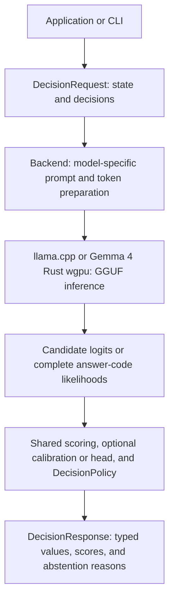

<a id="l2s1-guide"></a>
# L2S1 가이드

[English](../en/GUIDE.md) · [한국어](GUIDE.md) · [日本語](../ja/GUIDE.md)

[English index](../en/README.md) · [한국어 색인](README.md) · [日本語索引](../ja/README.md)

[영어 소개](../../README.md) · [한국어 소개](../../README.ko.md) · [기록된 모델 결과](MODEL_RESULTS.md)

자세한 빌드 지침, API 계약, 런타임 옵션 및 유효성 검사 절차. 첫 번째 판단에 대한 최단 경로를 보려면 README로 시작하세요.

<a id="build"></a>
## 빌드

순수 Rust 라이브러리는 네이티브 추론 없이 검증, 채점, 스칼라 보정 및 작업자 소유권을 지원합니다.

```sh
cargo test --locked
```

추론 백엔드와 CLI는 Linux(CPU 또는 CUDA), macOS(CPU 또는 Metal)를 지원합니다. Rust edition 2024를 지원하는 도구 체인, CMake, C++17 컴파일러가 필요합니다. Metal 빌드에는 Metal 컴파일러가 포함된 Xcode 도구 체인이 필요합니다. `l2s1-llama-sys` 작업공간 의존성은 llama.cpp와 해당 네이티브 브리지를 함께 빌드합니다.

```sh
cargo build --release --locked --features llama
# CUDA toolkit required for GPU support:
cargo build --release --locked --features llama-cuda
# macOS with Metal:
cargo build --release --locked --features llama-metal
```

특정 컴퓨팅 기능을 위한 독립적인 CUDA 빌드를 생성하려면 `scripts/build_cuda_arch.sh 86 89`를 실행하세요. 각 아키텍처에는 별도의 Cargo 대상 디렉터리와 일치하는 네이티브 라이브러리가 있는 `release/run-l2s1` 실행 프로그램이 있습니다. 스크립트에는 `readelf` 및 CUDA 툴킷이 필요합니다. [sm_86 빌드 및 공유 상태 캐시 측정](benchmarks/shared-state-cache-20260925/REPORT.md)는 이 PR 분기의 새로운 빌드 및 스모크를 포함하여 RTX 3080에서 확인되었습니다. 다른 아키텍처 빌드에는 여전히 자체 검증이 필요합니다.

아키텍처 빌드 스크립트는 설치 시 자동으로 C/C++/CUDA용 `ccache`를 사용합니다. 기존 `L2S1_NATIVE_COMPILER_LAUNCHER`를 존중합니다. 자동 감지를 비활성화하려면 `L2S1_BUILD_CACHE=off`를 설정하십시오. Rust 캐싱을 시도하려면 `RUSTC_WRAPPER=sccache`를 명시적으로 설정하세요. 측정된 독립 `sm_86` 빌드에서 `sccache`에는 별도의 Cargo 대상 디렉터리에 걸쳐 Rust 히트가 없었으므로 자동으로 활성화되지 않습니다. Cargo의 로컬 아티팩트를 재사용하려면 반복 빌드 전반에서 `L2S1_CUDA_TARGET_ROOT`를 안정적으로 유지하세요. 빈 `ccache`는 첫 번째 빌드를 느리게 만들 수 있습니다. 일회성 빌드에 적용하기 전에 [측정된 빌드 캐시 보고서](benchmarks/build-cache-20260925/REPORT.md)를 참조하세요.

기본 CPU 빌드는 CMake FetchContent를 사용하여 llama.cpp 개정 `3d82ef62d47fd74e18f36c5eccbdcf965b617b17`를 다운로드하고 확인합니다. 첫 번째 빌드에는 네트워크 액세스가 필요합니다. 오프라인 빌드 또는 다른 개정의 경우 `L2S1_LLAMA_CPP_SOURCE=/path/to/llama.cpp`를 설정하십시오. 레거시 `LLAMA_CPP_DIR` 소스 재정의도 작동합니다. `LLAMA_LIB_DIR`는 더 이상 사용되지 않습니다. 네이티브 계약 테스트를 통해 사용자 정의 개정을 검증하십시오. [확인 명령](VERIFICATION.md) 및 [기본 종속성 세부정보](crates/l2s1-llama-sys/README.md)를 참조하세요.

독립 소스 릴리스의 경우 `l2s1`보다 먼저 `l2s1-llama-sys`를 게시하세요. 빌드에는 로컬 Linux 및 macOS 실행 파일용 네이티브-library rpath가 포함되어 있습니다. 다운스트림 크레이트는 빌드 스크립트에서 `DEP_L2S1_LIBDIR`를 사용하여 자체 실행 파일에 대한 rpath를 설정할 수 있습니다. 사전 빌드된 실행 파일은 이식 가능한 로더 경로와 일치하는 네이티브 공유 라이브러리를 제공해야 합니다. `libllama.so` 또는 `libllama.dylib`만 교체하는 것은 지원되지 않습니다.

<a id="dataset-and-benchmark-tools"></a>
### 데이터 세트 및 벤치마크 도구

데이터 준비, 로컬 벤치마크 조정, 저장된 예측 감사 및 보고서 생성에는 저장소 전용 Rust `l2s1-tools` 바이너리를 사용합니다. llama.cpp를 연결하지 않습니다. 추론 명령은 별도로 빌드된 `evaluate_jsonl` 예제를 시작합니다. 모델 교육 및 직접 PyTorch 프로브는 Python 워크플로로 유지됩니다.

```sh
cargo build --release --locked -p l2s1-tools
target/release/l2s1-tools --help
```

인수 및 증거 경계에 대해서는 [tool 명령 map](crates/l2s1-tools/README.md) 및 각 벤치마크 가이드를 참조하세요. 아티팩트 비교 및 ​​학습 가져오기에는 기록 Python 어댑터를 계속 사용할 수 있습니다.

모델 파일은 호출자가 제공합니다. `models/` 또는 다른 디렉터리 아래에 적절한 문자 채팅/지시 GGUF를 배치하세요. CLI는 가중치를 다운로드하지 않습니다. 레코드 체크포인트 및 런타임 ID 로드 성공적인 모델 로드는 파일 체크섬을 한 번 계산하고 후속 로드를 위해 파일 ID별로 캐시합니다. 절대 `L2S1_MODEL_HASH_CACHE_DIR`를 설정하여 캐시를 재배치하거나 해당 항목을 제거하여 새로운 체크섬을 강제 적용합니다.

<a id="the-decision-contract"></a>
## 판단 계약

요청에서 JSON `state`와 하나 이상의 판단을 공유했습니다. 각 판단은 ID, 명령어 및 출력 종류를 제공합니다.

| 타입 | 정의 | 결과 |
| --- | --- | --- |
| `binary` | 거짓과 참 판단 기준 | `p_true` 및 선택적 부울 |
| `choice` | 의미론적 옵션 ID 및 판단 기준 | 선택적으로 선택된 옵션 ID |
| `ordinal` | 숫자 값이 엄격하게 증가하는 정렬된 수준 | 예상 값 및 선택적 선택 수준 ID |

예를 들면:

```json
{
  "state": { "storage_requirement": "chilled" },
  "decisions": [
    {
      "id": "storage_zone",
      "instruction": "Select the storage zone matching storage_requirement.",
      "kind": {
        "type": "choice",
        "options": [
          { "id": "ambient", "criterion": "Ambient storage is required." },
          { "id": "chilled", "criterion": "Chilled storage is required." },
          { "id": "frozen", "criterion": "Frozen storage is required." }
        ]
      }
    }
  ]
}
```

L2S1는 이러한 의미 체계 ID를 응답 코드에 매핑하고 모델의 실제 보조 응답 경계에서 토큰화를 확인합니다. 최대 26 옵션은 원래 `A`–`Z` 단일 토큰 경로를 유지합니다. 더 큰 후보 세트는 자동으로 고정 너비 코드(`AA`–`ZZ`, `AAA`–`ZZZ` 등)를 사용합니다. 코드가 여러 토큰에 걸쳐 있을 때 완전한 코드 시퀀스 가능성이 점수로 매겨집니다. 애플리케이션은 모델별 코드가 아닌 `chilled`를 선택한 값으로 받습니다. 토큰 경로와 원시 점수는 증거로 계속 사용할 수 있습니다. [답변 코드 확장 및 의도 평가](INTENT_BENCHMARK.md)를 참조하세요.

각 판단은 독립적으로 평가됩니다. 요청에는 동일한 상태에 대한 다양한 판단 종류가 포함될 수 있습니다. 이후 질문에서 이전 답변을 볼 수 있는 대화로 인코딩되지 않습니다. 세 가지 종류 모두에 대해서는 [`examples/warehouse.json`](../../examples/warehouse.json)를 참조하세요.

Rust 호출자는 입력된 `Level` 값을 사용하여 `Decision::ordinal(id, instruction, levels)`로 서열 판단을 구성할 수 있습니다. `ComputeOptions::default()`는 CLI 기본값(2048 컨텍스트,  256 배치 및 ubatch, 4개 스레드, flash attention 꺼짐, 자동 모델 로드 및 명시적 GPU 레이어 재정의 없음)을 사용합니다.

<a id="scores-and-abstention"></a>
### 점수 및 판단 보류

네이티브 후보 logits `z`의 경우 L2S1는 두 개의 개별 수량을 계산합니다.

```text
option_probability[i] = exp(z[i] - logsumexp(candidate logits))
candidate_mass        = exp(logsumexp(candidate logits) - logsumexp(all vocabulary logits))
```

`option_probability`는 제공된 옵션을 비교합니다. `candidate_mass`는 모델의 다음 토큰 확률이 해당 옵션에 얼마나 속하는지 측정합니다. 높은 후보 간 상대 확률만으로는 신뢰할 수 있는 답을 얻을 수 없습니다.

기본 `DecisionPolicy`는 최상위 후보 확률 **0.8 이상**, 후보 질량 **0.05 이상**, 최상위 후보 간 동점 없음을 요구합니다. 그렇지 않으면 선택값은 `null`이며 `abstention_reasons`가 이유를 설명합니다. 점수는 계속 반환합니다. 서열 기댓값은 확률로 가중한 수준값이며 선택이 보류되어도 제공됩니다.

이는 보편적인 정확성 확률이 아닌 모델 점수입니다. 부분적인 상위 k 응답 또는 모델 생성 수치 추정은 정확한 네이티브 증거 계약을 충족하지 않습니다.

<a id="inspect-validate-and-run"></a>
## 검사, 검증 및 실행

빌드 후 요청을 읽지 않고 모델을 검사합니다.

```sh
./target/release/l2s1 \
  --model models/SmolLM2-135M-Instruct-Q8_0.gguf --inspect
```

정방향 전달 없이 실제 요청의 템플릿, 후보 토큰, 컨텍스트 사용, 실행 지원 및 활성 아티팩트 바인딩을 확인합니다.

```sh
./target/release/l2s1 \
  --model models/SmolLM2-135M-Instruct-Q8_0.gguf \
  --input examples/warehouse.json --preflight
```

호환되는 모델 중 하나로 동일한 요청을 실행합니다.

```sh
./target/release/l2s1 \
  --model models/SmolLM2-135M-Instruct-Q8_0.gguf \
  --input examples/warehouse.json

./target/release/l2s1 \
  --model models/Qwen3-0.6B-Q8_0.gguf \
  --input examples/warehouse.json
```

요청 및 결과 스키마는 동일하게 유지됩니다. 각 모델은 자체 토크나이저와 프롬프트 프로필을 사용합니다. 자동 선택은 호환 가능한 조밀한 Qwen3 체크포인트를 위한 Qwen3의 non-thinking 프로필, GPT-OSS를 위한 Harmony 최종 사전 채우기, 기타 지원 모델을 위한 내장형 GGUF Jinja 템플릿을 사용합니다.

CPU가 기본값입니다. GPU 추론을 위해 명시적으로 `--device cuda` 또는 `--device metal`를 선택합니다. 사용할 수 없는 선택한 장치 또는 지원되지 않는 모델로 인해 오류가 발생합니다. 너무 큰 입력은 잘리지 않고 거부됩니다. `--context`, `--batch`, `--ubatch`, `--threads` 및 `--flash-attention off|auto|on` 제어는 컴퓨팅 설정을 요청했습니다. `--input -`는 stdin을 읽고 일반 결과는 stdout으로 이동하며 네이티브 로그는 stderr로 이동합니다. macOS에서는 Metal를 선택하기 전에 `--features llama-metal`로 빌드하세요. 네이티브 로그는 기본적으로 `L2S1_LOG=warn`를 사용합니다. 자세한 내용을 변경하려면 `error`, `info`, `debug` 또는 `off`를 설정하세요.

일반 응답, 모델 ID, 프롬프트 토큰 지문, 요청/유효 실행 모드, 대체 이유, 보정 ID 및 요청 로컬 타이밍이 포함된 별도의 봉투를 받으려면 `--diagnostics`를 추가하세요. 일반 `decide()` 응답은 기존 형태를 유지합니다. `--preflight` 또는 `--diagnostics` 아래의 요청 단계 실패는 구조화된 JSON 및 0이 아닌 종료 상태를 갖습니다. 모델 로딩 또는 잘못된 형식의 JSON는 해당 엔벨로프 이전에 실패할 수 있습니다.

<a id="rust-integration"></a>
## Rust 통합

`LlamaBackend`를 사용하려면 크레이트의 `llama` 기능을 활성화하세요.

`DecisionRequest`, `Decision`, `DecisionKind`, `OptionSpec` 및 `Level`를 사용하여 직접 요청을 구성합니다. JSON 파일 구문 분석은 필요하지 않습니다. 전체 [Rust 웨어하우스 예제](../../examples/warehouse.rs)는 모델 없이 바이너리, 선택 및 서열 판단을 구축하고 검증합니다.

```sh
cargo run --locked --example warehouse
```

호출자는 다른 모델 경로를 전달하는 동안 요청을 변경하지 않고 유지할 수 있습니다.

```rust
use std::path::Path;
use l2s1::{
    DecisionBackend, DecisionPolicy, DecisionRequest, DecisionResponse,
    llama::LlamaBackend,
};

fn decide_with_model(
    model: &Path,
    request: &DecisionRequest,
) -> l2s1::Result<DecisionResponse> {
    let mut backend = LlamaBackend::load(
        model, 2048, 256, 4, false, DecisionPolicy::default(),
    )?;
    backend.decide(request)
}
```

반복되는 요청의 경우 호출할 때마다 백엔드를 로드하는 대신 유지하세요. `inspect()`, `preflight()` 및 `decide_detailed()`는 해당 검사, 검증 및 진단 API를 노출합니다. `decide_batch()`는 독립적인 요청을 수락하고 결과 그룹화를 유지합니다.

`BackendWorker::spawn()`는 소유자 스레드에서 백엔드를 생성합니다. 공장에서는 비전송/비동기화 `LlamaBackend`를 반환할 수 있습니다. 네이티브 컨텍스트는 스레드 간에 이동하지 않습니다. 작업자는 대기 중인 요청 수와 직렬화된 요청 크기를 제한하고, 운영자가 예상한 메모리 예산을 예약하고, 전체 대기열을 즉시 거부하고, 허용된 작업에 대해 `DecisionTicket`를 반환합니다. `close()`는 작업을 비우고 동일한 스레드에서 백엔드를 삭제합니다. 예약은 운영 체제 RSS가 아닌 승인을 제어합니다. [worker 사용법 및 수명 주기](MODEL_INTERCHANGEABILITY.md#bounded-ownership-and-scheduling)를 참조하세요.

Metal에서 `BackendWorker::close()`를 호출하고 프로세스가 종료되기 전에 소유자 스레드가 `LlamaBackend`를 해제할 때까지 기다립니다. 직접 사용자는 종료하기 전에 `LlamaBackend`를 삭제해야 합니다. 이렇게 하면 모델이 로드된 상태에서 llama.cpp Metal 분해 어설션이 방지됩니다.

`BackendWorker::spawn_batched()`는 명시적인 요청 수, 모델 입력 토큰 및 수집 대기 제한에 따라 요청을 추가로 수집합니다. `LlamaBackend`를 사용하면 네이티브 일괄 처리에서는 `ExecutionMode::Parallel`를 선택해야 합니다. 다른 모드에서는 요청을 직렬로 유지합니다. 수집만으로는 추론을 병렬화할 수 없으며 기존 병렬 점수 드리프트 제한이 계속 적용됩니다.

<a id="optional-prompt-detail-and-answer-code-mixtures"></a>
### 선택적 프롬프트 세부 정보 및 응답 코드 혼합

`--prompt-detail minimal` 및 `--code-rotation 0`는 기존 프롬프트를 유지하고 기본값을 유지합니다. `typed`에는 판단 종류, 의미 체계 옵션 ID, 서열 값 및 정확한 비교 지침이 추가되었습니다. `typed-examples`는 또한 입력 앞에 일반적인 숫자 간격 예제를 추가합니다. 이러한 변형은 모델 중립성을 유지하고 스키마 변경을 허용하며 예측 및 컨텍스트 사용을 변경할 수 있습니다. 정답률 보증은 측정되지 않습니다.

```sh
./target/release/l2s1 --model models/Qwen3-0.6B-Q8_0.gguf \
  --input examples/warehouse.json --prompt-detail typed-examples --code-rotation 1
```

회전 변경 코드 할당: 표시된 위치 `i`는 표준 옵션 `(i + rotation) % option_count`를 나타냅니다. 백엔드는 음이 아닌 회전을 허용하고 옵션 개수의 모듈로를 줄이고 원래 서열 척도를 포함하여 원래 의미 순서로 점수를 반환합니다. 반환된 코드와 토큰 ID는 실제 순환 할당을 설명합니다. 해당 Rust 설정자는 `set_prompt_detail(PromptDetail::TypedExamples)` 및 `set_code_rotation(1)?`입니다. 둘 중 하나를 변경하면 준비 캐시가 지워지고 프롬프트 ID가 변경되므로 교정 및 헤드가 해당 구성과 일치해야 합니다. 기본 응답 JSON는 추가된 세부정보/회전 필드를 생략합니다.

다중 순환 패스의 경우 `score_semantic_mixture(&decision, &passes, &policy)`는 의미론적 옵션 ID를 기준으로 결과를 정렬하고 **전체 후보 확률**를 풀합니다.

```text
q(y)                    = mean(candidate_mass[pass] * option_probability[pass][y])
mixture candidate_mass  = mean(candidate_mass[pass])
mixture option_probability[y] = q(y) / sum(q)
```

이렇게 하면 매스 게이트를 하나로 설정하는 대신 유지됩니다. 보정되지 않은 네이티브 패스를 두 개 이상 허용합니다. 학습된-헤드, 보정되고 이전에 혼합된 결과는 거부됩니다. 호출자는 동일한 모델, 상태, 작업 및 추론 구성을 사용해야 하며 코드 회전만 변경해야 합니다. 혼합 점수는 보정된 정확성 확률이 아닙니다. 결과는 `semantic_probability_mixture_v1`로 표시됩니다. `raw_logit`는 `ln(q)`이고, 코드/토큰 메타데이터는 첫 번째 패스를 나타내며, 토큰 수는 모든 패스의 합계입니다. 추가 패스는 추가 추론 시간을 소비합니다.

[쌍 평가 예제](../../examples/evaluate_accuracy.rs)는 `id`, 선택적 `group` 및 하나가 포함된 `request`를 포함하는 JSONL 레코드에서 이러한 변형을 실행합니다. 판단:

```sh
cargo run --release --locked --features llama --example evaluate_accuracy -- \
  --model models/Qwen3-0.6B-Q8_0.gguf --input cases.jsonl \
  --output /tmp/l2s1-accuracy-passes.jsonl \
  --prompt-details minimal,typed,typed-examples --all-rotations
```

출력은 새로운 것이어야 합니다. 평가자는 답안 레이블을 읽지 않고 네이티브 통과, 혼합 결과, 구성 ID 및 타이밍을 기록합니다. 변형을 선택하기 전에 홀드아웃 라벨에 대해 별도로 작업 정답률 및 승인 수락률를 평가합니다.

<a id="direct-image-input-and-http-api"></a>
## 직접 이미지 입력 및 HTTP API

일치하는 멀티모달 프로젝터 GGUF(`mmproj`)를 사용하여 비전 지원 채팅 GGUF를 로드하세요. 프로젝터는 llama.cpp `libmtmd`를 통해 정지 이미지를 인코딩합니다. 그런 다음 L2S1는 결과 다음 토큰 logits에서 동일한 유형의 옵션에 점수를 매깁니다. `LlamaBackend::load_vision_projector(path)` 및 `LlamaBackend::decide_vision(&request, image_bytes)`는 Rust API를 노출합니다. `LlamaBackend::decide_vision_batch(&requests, &images)`는 각 요청의 상태와 이미지를 독립적으로 유지합니다. 기존 텍스트 요청은 여전히 ​​`decide`를 사용합니다.

옵트인 HTTP 수신기는 `POST /v1/decisions`에서 JSON를 수락하고 `GET /healthz`에서 준비 상태를 보고합니다.

```sh
cargo run --release --locked --features llama-cuda -- \
  --model /models/vision-model.gguf --mmproj /models/mmproj.gguf \
  --device cuda --context 4096 --listen 127.0.0.1:8080
```

버전이 지정된 API는 `media`라는 공유 `state` 및 판단을 허용합니다. 텍스트의 경우 `media`를 생략하세요. 각 판단은 `media_ids`를 설정하여 이미지를 선택할 수 있습니다. 생략하면 모든 이미지가 선택되고 `[]`는 없음을 선택합니다. 응답에는 항상 `api_version`, `request_id`, `backend`, `policy` 및 `results`가 있습니다. 모든 결과에는 `id`가 있으며 `value`, `status`, `abstention_reasons`, `evidence` 및 `usage`를 입력했습니다. 지역 증거에는 점수가 있는 `type: "model_scored"`와 후보 확률 질량이 있습니다. OpenRouter 증거에는 `type: "selection_only"`가 있으며 고안된 확률은 없습니다. 로컬 `policy`가 채워집니다. 원격 `policy`는 `null`입니다. `GET /v1/capabilities`를 사용하여 로드된 모델, 지원되는 이미지 입력, 증거 유형 및 제한을 검사합니다.

```json
{
  "state": {"task": "identify the object"},
  "media": [
    {"id": "front", "type": "image", "data_base64": "..."},
    {"id": "side", "type": "image", "data_base64": "..."}
  ],
  "decisions": [{
    "id": "object", "instruction": "Choose the main object",
    "kind": {"type": "choice", "options": [
      {"id": "box", "criterion": "a box"},
      {"id": "bag", "criterion": "a bag"}
    ]},
    "media_ids": ["front"]
  }]
}
```

선택 전용 응답은 로컬 응답과 동일한 결과 봉투를 갖습니다.

```json
{
  "api_version": 1,
  "request_id": "req-1",
  "backend": {"runtime": "openrouter-chat-completions", "model": "example/model", "details": null},
  "policy": null,
  "results": [{
    "id": "object", "value": {"type": "choice", "selected": "box"},
    "status": "selected", "abstention_reasons": [],
    "evidence": {"type": "selection_only", "selected_code": "A", "provider_model": "example/model"},
    "usage": {"input_tokens": 42, "output_tokens": 1}
  }]
}
```

기존 텍스트 요청의 경우 이 명령은 하나의 이미지를 첨부합니다.

```sh
jq --arg image "$(base64 -w0 photo.jpg)" '. + {media: [{id: "photo", type: "image", data_base64: $image}]}' \
  examples/warehouse.json | \
  curl -sS -H 'Content-Type: application/json' --data-binary @- \
  http://127.0.0.1:8080/v1/decisions
```

라이브러리는 여전히 base64 없이 원본 이미지 바이트를 허용합니다. CLI에 해당하는 것은 `--mmproj /models/mmproj.gguf --image photo.jpg --input request.json`입니다. 로컬 llama.cpp 및 wgpu 백엔드는 판단당 하나의 이미지를 허용합니다. OpenRouter 어댑터는 선택한 공급자 모델의 자체 제한에 따라 판단당 최대 4개의 이미지를 허용합니다. 이미지 바이트는 각각 8 MiB로, 각 요청은 128 판단으로, HTTP 본문은 44 MiB로 제한됩니다. 잘못된 미디어 참조 또는 백엔드 제한은 추론 전에 실패합니다. 26 이상의 옵션은 고정 너비 응답 코드를 사용합니다. 로컬 비전은 전체 어휘 점수를 사용합니다. llama.cpp 비전은 최대 26 옵션에 대한 전체 또는 압축 증거와 함께 신규 또는 옵트인 병렬 실행을 허용합니다. 이미지 요청에 대한 출력 헤드, 스칼라 보정 및 접두사 재사용/상태 복원 모드를 거부합니다. 병렬 비전은 현재 판단당 최대 26 옵션을 지원합니다. 더 넓은 응답 코드를 얻으려면 새로 실행을 사용하세요. Gemma 4 wgpu 비전은 요청-로컬 접두사 ​​재사용 및 상태 복원을 허용합니다. 수신기는 16 요청 추론 대기열 및 192 MiB 기내 바디 예산과 함께 최대 32 연결을 허용합니다. 로컬 추론 소유자는 HTTP 요청을 순차적으로 처리합니다. 병렬 llama.cpp 실행은 하나의 요청 내에서 독립적인 이미지 판단을 일괄 처리할 수 있습니다. 연결 슬롯이 남아 있으면 추론이 사용되는 동안 상태 및 기능 요청은 계속 응답합니다. 원격 클라이언트를 위해 루프백에 바인딩하거나 인증된 역방향 프록시를 그 앞에 배치합니다. 오류에는 `error.code`, `error.message` 및 `error.request_id`가 있습니다.

추가 Rust 백엔드는 `HttpDecisionBackend::capabilities` 및 `decide_json`를 구현합니다. 계약 계층은 응답을 보내기 전에 결과 ID와 공통 결과 필드의 유효성을 검사합니다. 백엔드는 공유 `value` 및 `status` 필드를 변경하지 않고 `evidence.type` 아래에 증거 필드를 추가할 수 있습니다.

네이티브 이미지 일괄 처리의 경우 `--execution-mode parallel --parallel-width 4` 및 일치하는 `--mmproj`를 사용하여 llama.cpp 수신기를 시작합니다. 한 번의 요청으로 4개의 미디어 항목을 보내고 각 독립 판단에 자체 `media_ids: ["image_id"]`를 제공합니다. 런타임은 호환 가능한 프로젝터 청크를 일괄적으로 인코딩하고 자체 디코더 시퀀스 및 KV 스트림에서 각 이미지 프롬프트를 평가합니다. 요청 그룹화만으로는 이를 활성화할 수 없습니다. `GET /v1/capabilities`는 병렬 이미지 실행이 활성화되었는지 여부를 보고합니다. 병렬 응답에는 최신 네이티브 웨이브의 프로젝터 및 디코더 카운터를 갖춘 `backend.details.vision_batch`가 포함됩니다. 일반 `fresh` 기본값은 이전 직렬 동작을 유지합니다. 병렬 채점은 새로운 채점과 다를 수 있으므로 대상 모델에 대한 판단과 확률을 비교하십시오. `--parallel-context-dynamic`는 웨이브의 가장 긴 이미지 프롬프트와 토큰 배치 헤드룸에 맞게 각 KV 스트림의 크기를 조정합니다. 네이티브 스케줄러가 안전하게 일괄 처리할 수 없는 프로젝터 레이아웃은 명시적 오류를 반환합니다.

네이티브 비전 일괄 처리는 최대 26 답변 옵션이 있는 호환 가능한 비반복, 비하이브리드 비전 모델에 대해 지원되는 실행 옵션입니다. [TrashNet 배치4 측정](benchmarks/trashnet-vision-20260925/REPORT.md#native-four-image-batching-2026-09-26)는 실제 디코더 배치를 검증하고 RTX 3080에서 처리 시간을 단축했지만 테스트된 세 개의 CUDA 체크포인트 모두 기존 수치 동등성 판단 기준에 실패했습니다. 점수와 판단을 보존해야 할 때 새로운 실행을 유지하세요.

Gemma는 가능한 비전 백엔드입니다: Gemma 3 4B/12B/27B 및 Gemma 4 E2B/E4B에는 이미지 가능 변형이 있습니다. llama.cpp. Gemma 3 1B는 텍스트 전용입니다. 비전 체크포인트를 일치하는 `mmproj`와 페어링합니다. 텍스트 전용 GGUF 파일만으로는 픽셀을 허용할 수 없습니다. [llama.cpp 다중 모달 모델 목록](https://github.com/ggml-org/llama.cpp/blob/master/docs/multimodal.md) 및 [Gemma 3 비전 가이드](https://github.com/ggml-org/llama.cpp/blob/master/docs/multimodal/gemma3.md)를 참조하세요.

CPU/CUDA Gemma 4 및 2개의 레이블이 지정된 이미지 고정 장치를 사용하여 대기 시간을 측정하려면 [direct 비전 벤치마크](VISION_BENCHMARK.md)를 참조하세요. 30 클래스,  150 이미지 CUDA가 HTTP 비전 API를 통해 실행되는 경우 [Caltech-101를 참조하세요. 벤치마크](benchmarks/caltech101-vision-20260924/README.md). 두 가지 답변 순서가 모두 포함된 70 이미지 고양이/개 검증에 대해서는 [Cats 및 Dogs 비전 보고서](benchmarks/cats-dogs-vision-20260924/REPORT.md)를 참조하세요. 이는 과거 HTTP 요청 형태를 기록하고 일반 이미지 정답률을 주장하지 않습니다. 6가지 종류의 폐기물 분류 및 프롬프트/수용 임계값 쌍 연구에 대해서는 [TrashNet 비전 벤치마크](benchmarks/trashnet-vision-20260925/REPORT.md)를 참조하세요.

<a id="openrouter-adapter"></a>
## 오픈라우터 어댑터

프로세스 환경에서 `OPENROUTER_API_KEY`를 설정하고 요청된 양식을 허용하는 [OpenRouter 모델](https://openrouter.ai/models)를 선택합니다. 선택적 실행 파일은 네이티브 llama.cpp 백엔드를 빌드하지 않습니다. 예를 들어, `prism-ml/ternary-bonsai-2-27b`는 텍스트와 이미지를 허용합니다. 이는 지역 Bonsai 27B Q1_0 GGUF와 다른 체크포인트입니다.

```sh
cargo run --release --locked --no-default-features --features openrouter \
  --bin l2s1-openrouter -- \
  --model prism-ml/ternary-bonsai-2-27b --reasoning-effort none \
  --input examples/warehouse.json
```

CLI의 이미지 하나에 대해 `--image photo.jpg`를 추가합니다. 어댑터는 최대 8 MiB까지 PNG, JPEG, GIF 및 WebP를 허용합니다. HTTP를 제공하려면 `--input ...`를 `--listen 127.0.0.1:8081`로 바꾸세요. 리스너는 `POST /v1/decisions`, `GET /v1/capabilities` 및 `GET /healthz`를 노출합니다. 최대 4개의 원격 HTTP 요청을 병렬로 실행합니다. 동일한 미디어 선택이 포함된 판단은 최대 4개의 병렬 완료 일괄 처리로 전송됩니다. `--max-tokens`는 판단당 완료 제한을 설정합니다(기본값 1024, 최대 4096). `--reasoning-effort`는 선택 사항이며 요청된 경우에만 전달됩니다. 선택한 모델에서 지원하는 값을 사용하세요.

주변 공백이 제거된 후 코드가 정확히 일치해야 합니다. 형식이 잘못되었거나 불완전한 모델 출력이 판단 보류됩니다. 고정 너비 코드는 26 옵션 이상을 지원합니다. 원격 응답에는 `scores`, `candidate_mass`, `top_option_probability`, `p_true` 또는 서열 예상 값이 없으며 로컬 확률 정책이 적용되지 않습니다. 서열 결과에는 선택한 수준의 `level_value`가 있습니다. 공급자 또는 전송 오류가 발생하면 HTTP 502가 반환됩니다. 모의 서버 테스트는 어댑터를 확인합니다. 실시간 OpenRouter 요청에는 API 키가 필요합니다. 공급자의 이미지 및 요청 제한은 선택한 모델에 따라 다르므로 `GET /v1/capabilities`는 어댑터 제한을 보고하고 공급자 제한을 모델 종속으로 표시합니다.

<a id="optional-wgpu-backend"></a>
## 선택적 wgpu 백엔드

`wgpu` 기능은 고정된 [rullama-engine](https://github.com/Brainwires/rullama-framework/tree/main/engine/rullama-engine) Gemma 4 텍스트 및 비전 구현을 사용합니다. Gemma 4 텍스트 GGUF를 단독으로 또는 일치하는 `mmproj` GGUF와 함께 허용합니다. 스트리밍 어댑터는 쌍을 이루는 파일을 하나의 가상 GGUF로 엔진에 노출합니다. 모델 가중치는 원본 파일에서 읽어옵니다. GPU 추론 및 이미지 인코딩은 Rust wgpu를 사용합니다. 이 기능에는 wgpu GPU 어댑터가 필요하며 `--allow-software-adapter`가 개발용으로 명시적으로 설정되지 않는 한 소프트웨어 Vulkan 어댑터를 거부합니다. macOS에서 `WGPU_BACKEND=metal` 및 `--require-metal`를 설정하여 네이티브 Metal 어댑터를 적용합니다. Gemma 4 E2B Q8_0 쌍은 소프트웨어 wgpu를 통해 로컬로 확인되었습니다. 네이티브 GPU 품질 및 기타 체크포인트 크기는 여전히 검증이 필요합니다.

```sh
cargo run --release --locked --features wgpu --bin l2s1-wgpu -- \
  --model /models/gemma-4-E2B-it-Q8_0.gguf \
  --mmproj /models/mmproj-gemma-4-E2B-it-Q8_0.gguf \
  --image photo.jpg \
  --input examples/warehouse.json
```

텍스트 판단을 위해 `--mmproj` 및 `--image`를 생략합니다. 아래 설명된 동일한 `POST /v1/decisions` 및 `GET /healthz` API를 제공하려면 `--listen 127.0.0.1:8080`를 추가하세요. 비전 요청을 위해 `media`를 보내세요. 이미지는 최대 25 메가픽셀까지 디코딩되고 긴 쪽의 최대 432 픽셀로 크기가 조정되어 비전 인코더의 48 픽셀 그리드에 정렬됩니다. wgpu 경로는 바이너리, 선택 및 서열 판단에 대한 전체 어휘 대량 및 완전한 멀티 토큰 응답 코드에 점수를 매깁니다. CLI에서 `--snapshot-limit-bytes` 및 `--diagnostics`를 사용하여 요청 로컬 `fresh`, `prefix-reuse` 및 `state-restore` 실행을 지원합니다. 멀티 토큰 응답 코드는 새로운 평가를 사용합니다. `parallel`, LoRA, 출력 헤드 및 스칼라 보정은 아래의 일반 llama.cpp 경로를 사용합니다. GPU 점수는 llama.cpp와 다를 수 있습니다. 보정된 확률로 처리하기 전에 각 모델과 작업을 검증합니다.

이 페어링된 GGUF 어댑터는 Gemma 4에만 적용되며 Qwen 모델/프로젝터 파일을 거부합니다. Bonsai, Qwen, SmolLM 및 기타 호환 가능한 GGUF 채팅 모델의 경우 기존 llama.cpp 백엔드를 사용합니다. 선택한 GGUF의 토크나이저 및 채팅 템플릿을 읽고 동일한 유형의 판단 및 HTTP API를 노출합니다. CUDA 빌드는 NVIDIA GPU를 지원합니다. `llama-metal` 빌드는 macOS에서 Apple Metal를 지원합니다.

```sh
cargo run --release --locked --features llama-cuda -- \
  --model /models/Qwen3-0.6B-Q8_0.gguf \
  --device cuda --input examples/warehouse.json

# macOS
cargo run --release --locked --features llama-metal -- \
  --model /models/Qwen3-0.6B-Q8_0.gguf \
  --device metal --input examples/warehouse.json
```

다른 호환 가능한 GGUF를 로드하려면 `--model`를 변경하세요. 텍스트 모델에는 모델 파일만 필요합니다. 지원되는 비전 모델의 경우 일치하는 `--mmproj` 파일을 제공하고 CLI 또는 HTTP API를 통해 이미지를 보냅니다. llama.cpp Metal 경로는 기존 출력 헤드, LoRA, 보정, 실행 모드 및 HTTP 계약을 유지합니다. 각 모델에는 자체 백엔드 인스턴스와 작업 품질 평가가 필요합니다. 이 경로에는 FlareLLM 또는 Qwen-specific Rust wgpu 어댑터가 필요하지 않습니다. A [two-model CUDA 스모크 측정](benchmarks/gguf-cuda-20260925/README.md)는 모델 ID, 판단, 판단 보류 및 타이밍을 기록합니다. Metal 성능을 설정하지 않습니다.

| Metal 실행 경로 | GGUF 모델 | 비전 | 실행 | 추가 기능 |
| --- | --- | --- | --- | --- |
| Rust wgpu | Gemma 4 | Gemma 4 `mmproj` 일치 | fresh, 접두사 재사용, 상태 복원; 멀티 토큰 코드는 fresh를 사용합니다. | 동일한 유형의 CLI 및 HTTP 판단 |
| llama.cpp | 호환되는 Bonsai 및 Qwen GGUF를 포함하여 고정된 llama.cpp 개정에서 지원되는 모델 | `mmproj`와 일치하는 지원 모델 | 기존의 새로운 접두사 재사용, 상태 복원, 병렬 계약. 비전은 최신 및 옵트인 병렬을 지원합니다. | LoRA, 보정, 출력 헤드, 진단, HTTP |

`wgpu` 실행 파일은 `parallel`를 거부합니다. 필요할 때 llama.cpp Metal 경로를 사용하세요. 실제 Metal 추론과 결과 동등성을 검증하려면 호환되는 모델 파일이 있는 Mac이 필요합니다.

<a id="optimized-vision"></a>
## 최적화된 시력

`--vision-optimized`를 `--model` 및 `--mmproj`를 사용하여 CUDA 또는 Metal 호출에 추가하여 호환 가능한 비전 처리량 설정을 함께 활성화합니다. 4개의 독립 디코더/KV 스트림, 동적 컨텍스트 예약, 토큰 배치/마이크로 배치 1024, Flash Attention, 컴팩트 증거, 8 MiB 제한된 준비 캐시 및 동일한 프로젝터 임베딩의 요청 로컬 재사용. 재사용이 활성화되면 각 고유 이미지 청크가 독립적으로 인코딩되어 다른 이미지 점수를 격리된 상태로 유지합니다. 기본 병렬 경로는 여전히 프로젝터 청크를 일괄 처리할 수 있습니다. 기본 컨텍스트는 질문당 4096입니다. `--context`, 스레드 및 레이어 배치는 여전히 명시적으로 조정할 수 있습니다. 개별 최적화 플래그는 부분 프로필을 자동으로 선택하지 않도록 이 프로필과 충돌합니다. GPU/커널 지원이 필요합니다. Metal 성능은 검증되지 않았습니다.

Rust의 경우 `ComputeOptions::vision_optimized()`를 사용하여 백엔드를 구성하고 일치하는 프로젝터를 로드한 다음 `backend.enable_vision_optimizations()?`를 호출합니다. 상주 백엔드는 준비된 프롬프트를 유지합니다. 이미지 임베딩은 하나의 네이티브 웨이브 내에서만 재사용됩니다. 후보자 집단 게이트는 여전히 완전한 어휘를 사용합니다. 네이티브 메모리가 이미 깨끗하면 중복된 KV 지우기가 전역적으로 건너뜁니다. Rust 전용 오류 및 네이티브 오류는 여전히 상태를 무효화합니다.

정확한 준비 캐싱, 압축 증거 전송 및 더티 전용 KV 지우기가 이 프로필의 구성 요소입니다. 격리된 검사는 변경되지 않은 컴퓨팅 구성에서 점수를 보존합니다. 이를 병렬 디코딩 및 Flash Attention와 결합하면 여전히 예측이 변경됩니다. 직렬 구성 요소 실험에서는 속도 향상이 이루어지지 않았습니다. 프로필은 호환 가능한 GPU 비전 모델에 지원됩니다. 디코더/프로젝터 배치 형태 및 관심 커널은 예측을 변경할 수 있습니다. 비반복적, 비하이브리드 모델과 최대 26 답변 옵션을 지원합니다. 접두사 재사용/공유 상태 세션과 스냅샷 복원은 별도의 실행 전략으로 유지됩니다. 독립 이미지는 해당 이미지 KV 상태를 공유할 수 없습니다. [TrashNet 측정](benchmarks/trashnet-vision-20260925/REPORT.md)를 참조하세요.

<a id="model-specific-identity-and-calibration"></a>
## 모델별 ID 및 보정

`ModelIdentity`는 체크포인트, 내장된 템플릿, 효과적인 프롬프트 프로필/버전, 런타임 빌드 및 로드된 라이브러리, 활성 어댑터/헤드, 장치 레이블 및 컴퓨팅/실행 구성을 지문으로 식별합니다. `preflight()`는 해당 ID를 실제 요청 확인과 결합합니다. 능력 검사를 통해 사용 가능한 작업을 설정합니다. 분류된 평가는 작업 품질을 설정합니다.

선택적 스칼라 온도 보정은 옵션 순서 및 서열 값을 포함하여 모델/구성 지문 및 정확한 작업 서명에 바인딩됩니다. 바인딩을 변경하면 아티팩트를 다른 모델에 적용하는 대신 거부됩니다. 보정은 원시 logits 및 기본 후보 확률 질량을 유지하지만 수락 확률 및 수락률는 변경될 수 있습니다.

```sh
cargo run --release --locked --example fit_calibration -- \
  fit-input.json task-temperature.json

./target/release/l2s1 \
  --model models/SmolLM2-135M-Instruct-Q8_0.gguf \
  --input examples/warehouse.json \
  --calibration task-temperature.json --diagnostics
```

[보정 입력 스키마 및 평가 계약](MODEL_INTERCHANGEABILITY.md#scoped-scalar-calibration)는 측정된 원시 점수 기록, 독립 소스 그룹, 홀드아웃 NLL/Brier 및 정책 수락률 검사를 설명합니다. 훈련된 보정은 번들로 제공되지 않습니다. 여러 작업 범위 아티팩트를 등록할 수 있지만 스칼라 보정은 출력 헤드와 스택될 수 없습니다.

호환 가능한 GGUF LoRA는 `--lora`와 함께 로드될 수 있습니다. 학습된 작업별 채점자는 `--output-head`로 로드할 수 있습니다. 숨겨진 기능 헤드에는 현재 Gemma4가 필요하며, 헤드에는 기록된 신규 실행 구성이 필요합니다. 이는 선택적 전문화입니다. [LoRA training](DECISION_FINETUNE.md) 및 [output-헤드 contract](OUTPUT_HEAD.md)를 참조하세요.

<a id="execution-and-memory"></a>
## 실행과 메모리

| `--execution-mode` | 동작 | 상태 |
| --- | --- | --- |
| `fresh` | 빈 시퀀스 상태에서 모든 판단을 평가합니다. | 기본값 |
| `prefix-reuse` | 한 요청 내에서 정확한 공통 토큰 접두어의 전체 사전 채우기 배치를 재사용합니다. | 선택; 반복/하이브리드 메모리가 새로운 메모리로 돌아갑니다. |
| `state-restore` | 공통 접두사의 전체 시퀀스 상태를 저장하고 나중에 독립된 접미사를 위해 복원합니다. | 지원됨, 선택 가능; 테스트된 하이브리드 Bonsai GGUF와 함께 작동 |
| `parallel` | 공유 접두사 미리 채우기를 사용하여 독립적인 질문을 격리된 시퀀스로 일괄 처리 | 지원됨; 반복/하이브리드 모델을 거부하고 점수를 변경할 수 있습니다. |

기본 프롬프트 레이아웃은 `legacy`입니다. `--prompt-layout state-first`는 공유 상태를 더 일찍 배치하고 재사용 가능한 더 긴 접두사를 노출할 수 있지만 프롬프트도 변경하고 예측을 변경할 수도 있습니다.

```sh
./target/release/l2s1 --model models/Qwen3-0.6B-Q8_0.gguf \
  --input examples/warehouse.json \
  --prompt-layout state-first --execution-mode state-restore \
  --snapshot-limit-bytes 268435456 --diagnostics
```

상태 복원은 기본적으로 스냅샷 버퍼를 256 MiB로 제한하고 스냅샷을 사용할 수 없는 경우 새로운 대체를 보고합니다. 완전한 증거 이전이 필요합니다. `prefix-reuse`는 여전히 해당 모델에서 최신 상태로 돌아가기 때문에 순환/하이브리드 모델에 대해 명시적으로 `state-restore`를 사용하세요. `--parallel-width`는 병렬 웨이브당 질문을 제한하고 컨텍스트 메모리를 늘립니다. 일반 요청은 요청 경계 및 오류 이후 네이티브 KV 상태를 지웁니다. 스냅샷은 네이티브 호출에서 유지되지 않습니다. 스냅샷 제한이나 작업자 예약은 전체 프로세스 메모리 제한이 아닙니다.

`--parallel-context-dynamic`는 해당 웨이브의 실제 입력 토큰과 헤드룸 배치 1개를 더해 각 병렬 KV 컨텍스트의 크기를 판단합니다. `--context`는 질문당 입력 제한으로 유지됩니다. 이후의 웨이브가 클수록 컨텍스트가 커지고 동일한 유효 질문 수에서 가장 큰 할당을 유지합니다. 응답 보고서 `backend.parallel_context_tokens`; 컨텍스트 크기를 변경하면 점수가 변경될 수 있으므로 대상 모델에서 판단 동등성을 확인하세요.

상태 복사에는 비용이 들고 속도 향상을 보장하지 않습니다. [Bonsai RTX 3060 검증](benchmarks/bonsai-state-restore-20260925/REPORT.md)는 고정된 16-판단 픽스처에 실제 하이브리드 모델 재사용과 정확한 최신 결과 패리티를 기록합니다. 병렬 실행은 일부 체크포인트에서 확률과 최선의 선택 차이를 측정했습니다. 둘 다 명시적인 옵션으로 남아 있습니다. [실행 세부정보](MODEL_INTERCHANGEABILITY.md#request-local-state-restoration) 및 [병렬 실행](PARALLEL_EXECUTION.md)를 참조하세요.

<a id="optional-preparation-and-evidence-optimizations"></a>
### 선택적 준비 및 증거 최적화

VRAM보다 큰 모델의 경우 CUDA 로딩은 `--gpu-layers N` 또는 `--cpu-moe-layers N`를 허용하여 CPU RAM에 가중치의 일부를 배치합니다. 배치는 컴퓨팅 ID에 기록되며 숫자 점수를 변경할 수 있습니다. [CPU/GPU 배치](MODEL_INTERCHANGEABILITY.md#cpugpu-placement)를 참조하세요.

낮은 모델 로딩 피크 프로세스 RSS의 경우 `--model-load-mode read`를 사용합니다. [로드 동작 및 측정 제한](MODEL_INTERCHANGEABILITY.md#model-loading-and-peak-host-rss)를 참조하세요.

레거시 프롬프트, 새로운 실행, 전체 증거 전송 및 비활성화된 준비 캐싱이 기본값으로 유지됩니다. 기존 반복 요청 및 수정된 판단 스키마는 계속 작동합니다. 이러한 옵션 중 어느 것도 고정된 스키마가 필요하지 않습니다.

```sh
./target/release/l2s1 --model models/Qwen3-0.6B-Q8_0.gguf \
  --input examples/warehouse.json --evidence-transfer compact \
  --preparation-cache-bytes 8388608 --preparation-cache-entries 128
```

- **Preparation 캐시:**는 로드된 백엔드 내에서 정확히 준비된 프롬프트와 답변 경계 후보 매핑을 유지합니다. `PreparationCacheConfig`는 캐시당 항목을 제한하고 캐시 간에 1바이트 예산을 나눕니다. 점수나 KV 상태가 아닌 토큰 준비를 저장합니다. 새로운 상태와 스키마는 일반 준비 경로를 사용합니다. 반복 통화는 백엔드가 계속 상주할 때 가장 큰 이점을 제공합니다.
- **간략한 증거:**는 완전한 네이티브-host-to-Rust를 피하면서 후보 logits 및 전체 어휘 노멀라이저를 유지합니다. logits 사본. llama.cpp는 여전히 전체 어휘를 ​​계산하여 호스트에서 사용할 수 있도록 합니다. 이는 GPU측 축소 또는 출력-헤드 제거가 아닙니다. 학습된 출력 헤드 없이 텍스트 새로 만들기/접두사 재사용 및 이미지 새로 만들기/병렬 실행을 지원하며 고유한 보정 ID를 갖습니다.
- **명시적 공유 상태:** `backend.shared_state(state)?`는 `PrefixReuse`용으로 구성된 백엔드를 차용합니다. `session.decide(decisions)` 호출을 반복하면 ID, 지침, 옵션 개수 및 판단 종류가 변경될 수 있으며, 동시에 해당 불변 상태에 대해 정확한 디코더 접두어를 공유할 수 있습니다. 세션 생성, 오류 및 삭제로 인해 네이티브 상태가 삭제됩니다. 순환/하이브리드 모델 및 출력 헤드는 거부됩니다. 이는 별도로 훈련된 상태 인코더가 아닌 디코더 세션입니다.

[최적화 API 및 제한](MODEL_INTERCHANGEABILITY.md#optional-execution-optimizations)를 참조하세요. [local 벤치마크 하네스](../../examples/benchmark_optimizations.rs)는 혼합 스키마 웨어하우스 질문을 사용하여 최신 경로, 캐시된 경로, 압축 경로 및 공유 상태 경로를 비교하고 원시 점수와 선택 차이를 기록하며 출력 덮어쓰기를 거부합니다.

```sh
cargo run --release --locked --features llama --example benchmark_optimizations -- \
  --model models/Qwen3-0.6B-Q8_0.gguf --output /tmp/l2s1-optimizations.json
```

추가 체크포인트에 대해 `--model`를 반복합니다. GPU 실행에는 명시적으로 `--cuda`를 사용하세요. 기본 벤치마크에서는  1/4/16 질문과 짧은/긴 합성 상태라는 세 가지 라운드를 사용합니다. 타이밍을 맞추기 전에 각 경로를 준비하고 경로 순서를 회전하며 공유 상태 결과를 동일한 상태 우선 프롬프트 레이아웃과 비교합니다. 타이밍은 일반적인 속도 향상이나 작업 정답률이 아닌 로컬 워크로드 동작을 설정합니다.

<a id="compatibility-and-validation"></a>
## 호환성 및 검증

호환 가능한 체크포인트는 연결된 런타임에서 지원하는 디코더 전용 모델이어야 하며, 페이로드를 유지하고 선택한 장치/컨텍스트에 맞는 렌더링 가능한 GGUF 채팅 템플릿이 있어야 합니다. 판단에는 최소 두 명의 후보자가 필요합니다. 응답 코드 너비는 알파벳 파생 카운트 한도 없이 자동으로 늘어납니다. 원래 경로에는 고유한 단일 토큰 연속이 필요합니다. 다중 문자 코드에는 안정적이고 고유하며 접두사가 없는 토큰 시퀀스가 ​​필요하며 출력 헤드, 스칼라 보정 또는 기능 내보내기 없이 완전한 증거로 새로운 실행 또는 접두사 재사용 실행을 지원합니다. 프롬프트 길이, 답변 접두사 길이 및 사용 가능한 메모리는 여전히 실제 작업 부하를 제한합니다. 일반적인 가족 이름 약속보다는 실제 모델 동작을 기준으로 호환성을 확인합니다.

로컬 적합성 검사에는 SmolLM2, Qwen3, Gemma3, TinyLlama, Gemma4, `qwen35` 하이브리드 아키텍처가 포함된 Qwen3.8 파일 및 전체 GPT-OSS가 포함되었습니다. CPU/CUDA 구성. 지원은 체크포인트 및 구성별로 유지됩니다. 해당 모델에 대한 [검증 가이드](VERIFICATION.md)를 사용하세요. 적합한 템플릿이 없는 기본 모델, 인코더 전용 모델 및 검증되지 않은 다중 모드 구성은 검증된 계약 범위를 벗어납니다. 직접 이미지 경로에는 자체 체크포인트 및 작업 유효성 검사가 필요합니다.

```sh
cargo test --locked
cargo test --release --locked --features llama

L2S1_CONFORMANCE_MODELS=/path/to/model-a.gguf:/path/to/model-b.gguf \
  L2S1_CONFORMANCE_REPORT=/tmp/conformance.json \
  cargo test --release --locked --features llama \
  --test conformance -- --ignored --nocapture
```

일반 테스트 실행에서는 모델 종속 테스트를 건너뜁니다. 로컬 체크포인트를 사용하여 명시적으로 호출합니다. CUDA에서 적합성을 실행하려면 `SKID_CUDA=1`를 추가하세요. 테스트에서는 가중치를 다운로드하지 않습니다. 계약 확인은 운영 환경 정답률이 아닌 합성 호환성을 설정합니다. 생성된 적합성 보고서 및 벤치마크 아티팩트를 로컬 출력 디렉터리에 보관합니다.

<a id="architecture"></a>
## 건축



| 구성 요소 | 역할 |
| --- | --- |
| [`decision.rs`](../../src/decision.rs) | 요청/응답 유형, `DecisionBackend`, 공유 채점 및 수락 정책 |
| [`prompt.rs`](../../src/prompt.rs) | 상태, 지침 및 옵션을 선택한 프롬프트 레이아웃으로 컴파일 |
| [`llama.rs`](../../src/llama.rs) | 모델/컨텍스트 소유, 프롬프트 프로필 선택, 입력 토큰화, 추론 발송 및 결과 조합 |
| [`wgpu.rs`](../../src/wgpu.rs), [`paired_gguf.rs`](../../src/wgpu/paired_gguf.rs) | Rust wgpu Gemma 4 텍스트/비전 추론 및 페어링된 GGUF 스트리밍 |
| [`vision.rs`](../../src/vision.rs), [`http/contract.rs`](../../src/http/contract.rs), [`http.rs`](../../src/http.rs) | 이미지 검증, 유선 계약 및 백엔드 매핑, HTTP 연결 처리 |
| [`openrouter.rs`](../../src/openrouter.rs) | 원격 채팅 완료 및 선택 전용 응답 매핑 |
| [`l2s1-llama-sys`](../../crates/l2s1-llama-sys), [`bridge.cpp`](../../crates/l2s1-llama-sys/native/bridge.cpp), [`chat.cpp`](../../crates/l2s1-llama-sys/native/chat.cpp) | llama.cpp 호출, GGUF Jinja 템플릿 렌더링, 시퀀스 메모리 관리 및 추론 증거 복사 |
| [`evidence.rs`](../../src/evidence.rs) | 전체 어휘 logits를 검증하고 의미론적 옵션/토큰 매핑을 보존합니다. |
| [`codes.rs`](../../src/codes.rs), [`llama/code_sequences.rs`](../../src/llama/code_sequences.rs) | A-Z/AA-ZZ/AAA-ZZZ 코드 크기를 지정하고 더 큰 후보 세트에 대한 전체 토큰 경로의 점수를 매깁니다. |
| [`calibration.rs`](../../src/calibration.rs), [`output_head.rs`](../../src/output_head.rs) | 선택적 작업 범위 온도 보정 또는 학습된 출력 채점 |
| [`interoperability.rs`](../../src/interoperability.rs), [`llama/interchange.rs`](../../src/llama/interchange.rs) | 모델 지문, 기능, 요청 사전 검증, 구조적 오류 및 실행 진단 |
| [`worker.rs`](../../src/worker.rs) | 백엔드의 제한된 허용 및 전용 스레드 소유권 |

표준 CLI는 `LlamaBackend`를 직접 호출합니다. 선택적 GPU CLI는 `WgpuBackend`를 호출합니다. 장기 실행 애플리케이션은 `BackendWorker` 뒤에 백엔드를 배치할 수 있습니다.

<a id="further-documentation"></a>
## 추가 문서

| 주제 | 문서 |
| --- | --- |
| ID, 사전 검증, 보정, 진단 및 작업자 API | [모델 호환성](MODEL_INTERCHANGEABILITY.md) |
| 빌드 및 모델별 검증 | [검증 가이드](VERIFICATION.md) |
| 접두사 재사용 및 병렬 실행 | [접두사 알고리즘](SEMIF_ALGORITHM.md), [병렬 실행](PARALLEL_EXECUTION.md) |
| 평가방법 | [합성 벤치마크](BENCHMARK.md), [AG News](KAGGLE_BENCHMARK.md), [JevBench](JEVBENCH.md), [Laya/Jev 작업 및 CPU 캐싱](LAYA_BENCHMARK.md) |
| 선택적 모델/작업 적응 | [판단 미세 조정](DECISION_FINETUNE.md), [출력 헤드](OUTPUT_HEAD.md) |
